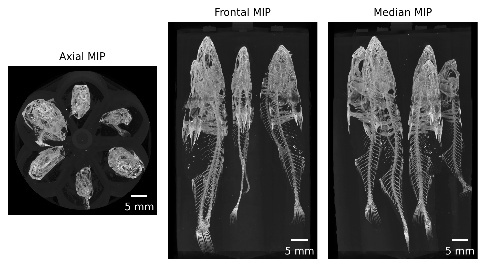
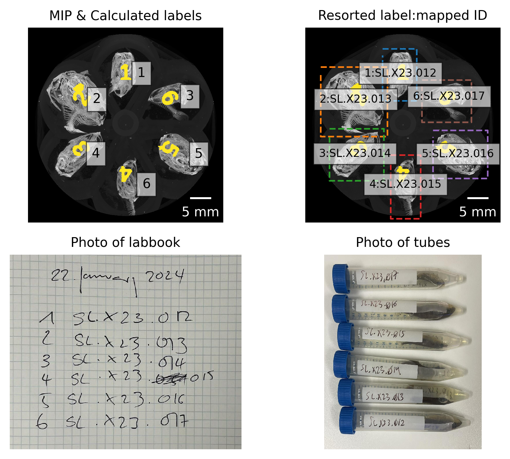

## Materials & Methods {.page_break_before}

{#fig:workflow}

### Sample procurement and preparation

The specimens used for this study were collected from source lakes as a part of the FITNESS project in the region of Cook Inlet, Alaska.
Fish were collected using unbaited minnow traps in two separate field seasons, the first taking place from May 26 - June 10 2023 and the second taking place from May 25 - June 11 2024.
Specimen collections were taken from a random sample of 30 fish from each lake.
Fish were euthanized with MS-222, photographed, and preserved in formalin in a bag with a specific label.
At the end of each field season, samples were shipped from Anchorage (AK, USA) to Bern (BE, CH) where they were stored until scanning time.

<!-- How were they kept/stored? 75% Ethanol?-->
<!-- Add the permits and numbers once we get them! -->

Due to their inherent contrast difference to the surrounding tissue, the structures of interest we touch upon in this manuscript (teeth and bones, i.e. jaws and skull) are well visualized in unstained samples, hence no further preparation of the fish was necessary.

### microtomographic imaging

In a small pilot study we determined the optimal scanning parameters to fit the constraints on total scanning time, resolution and sample handling.
To optimize for these constraints, we scanned all the sticklebacks in batches of six fish in a custom-made 3D printed sample holder in a single scan.
This holder was generated with [OpenSCAD](https://openscad.org/) and is available online, either directly as [STL file for printing](https://github.com/TomoGraphics/Hol3Drs/blob/master/STL/Stickleback.Multiple.stl) or as [(parameterized) OpenSCAD file](https://github.com/TomoGraphics/Hol3Drs/blob/master/Stickleback.Multiple.scad) for adaptation to other classes of samples.
Both files are part of a library of 3D-printable sample holders for tomographic imaging [@doi:10.5281/zenodo.2587555].

Tomographic imaging was performed on a [Bruker SkyScan 2214](https://www.bruker.com/en/products-and-solutions/diffractometers-and-x-ray-microscopes/3d-x-ray-microscopes/skyscan-2214.html) at the Institute of Anatomy, University of Bern, Switzerland.
In total we performed 44 scans, each of the scan usually containing 6 fish in the sample holder.

The relevant details of each scan are collated in a table in the [Supplementary Materials]; a short overview of the scanning parameters is given below.
The X-ray source was set to a voltage of 60 kV and a current of around 110 µA for all but one scan where we used a source voltage of 49 kV and 159 µA due to operator error.
For each sample, we recorded a set of 3601 projections of approximately 3000 x 2000 pixels at every 0.1° over a 360° sample rotation.
Every single projection was exposed for about a second (depending on the sample).
Due to the length of the fish, we had to acquire so-called stacked scans, on average we scanned 3 fields of view along the rotation axis of the sample holder.
This resulted in scan times between 3 to 5 hours.
The projection images were then subsequently reconstructed into a 3D stack of images with NRecon (Bruker microCT, Kontich Belgium, Version: 2.1.0.1 or 2.2.0.6).
The isometric voxel sized in the resulting datasets vary from 15 to 19 µm.

### Data analysis

#### Preparation and handling of tomographic datasets

After acquisition, [a simple script](https://github.com/habi/sticklebacks/blob/main/rsync-sticklebacks.sh) was used to copy the relevant data to both archival storage and storage accessible by all co-authors at the same time.

Further processing of the tomographic dataset was performed with a set of Jupyter [@doi:10.3233/978-1-61499-649-1-87] [notebooks](https://github.com/habi/sticklebacks) [@doi:10.5281/zenodo.18257528].
The scripts are freely available online under the MIT License and may be freely used, modified, and redistributed for research, teaching, and other non-military purposes.

##### Preview notebook

The [preview notebook](https://nbviewer.org/github/habi/sticklebacks/blob/main/PreviewScans.ipynb) is used for surfacing issues with the scanning.
For this, we read all relevant scanning and reconstruction parameters from the log files of each scan.
Afterwards, we efficiently loading the reconstruction PNG images from disk with the [`dask_image.imread.imread`](https://image.dask.org/en/latest/dask_image.imread.html) function [@dask].
Like so, we can map all the generated reconstructions to memory and quickly generate maximum intensity projections (MIP) of each scan (see Figure @fig:mips for an example) for both quality control and further processing.

{#fig:mips}

##### Separation notebook

The [separation notebook](https://nbviewer.org/github/habi/sticklebacks/blob/main/BucketSeparator.ipynb) processes all the performed scans to extract the single fish out from each scan, where 6 fish have been scanned.
As in the preview notebook, we efficiently load all the PNGs from disk with [`dask`](https://www.dask.org/) [@dask].
Based on the previously extracted MIP images and a simple labeling of these images (`skimage.measure.label`), we extract both the labels in the custom-made sample holder and the positions of single fish in the scan (`skimage.measure.regionprops`) (see Figure @fig:labels).
This extraction is completely reproducible and well-adapted to the custom-made sample holder.

{#fig:labels}

Based on a simple mapping of the detected region to the ID numbers of the scanned fish, we labeled the resulting images and presented these images together with photos of the lab book and sample tubes for double-checking (see Figure @fig:checking).

{#fig:checking}

The `skimage.measure.regionprops` function we used for labeling returns not only the positions of the detected fish, but also the extent of the bounding box of the region of the fish shown in the original image.
We extracted each region of each fish separately out of the large reconstructions (with a configurable border buffer, see Figure @fig:cropping) and wrote these extracted regions to disk in discrete folders for efficient further analysis.
In a first step, we wrote the regions of the single fish to disk in `zarr` [@doi:10.5281/zenodo.3773450] format, which is a preferred format to store n-dimensional arrays on disk.
In addition to this, we also wrote a log file for each extracted region, containing all relevant information to redo the cropping step completely manually (an [example of such a log file](https://github.com/habi/sticklebacks/blob/main/logfiles/BucketOfFish_H/rec_regions/SL.X23.016/SL.X23.016.log) is shown as part of the processing repository).

{#fig:cropping}

Saving out the regions as `zarr` files made it possible to efficiently work with the image data of each extracted fish and to convert that data to any desired format for further analysis.
For this further analysis, we wrote out stacks of PNG images and additionally, as [`nrrd`](https://teem.sourceforge.net/nrrd/) files for each fish region as a simple crop out of the original dataset and as binarized regions, which are segmented into bone and background based on a simple multi-level Otsu thresholding method [@doi:10.6688/JISE.2001.17.5.1].

Using `K3D-jupyter` [@url:https://k3d-jupyter.org] we implemented a quick way to view any of the extracted regions directly in the Jupyter notebook (see Figure @fig:k3d).
An [interactive version of this figure](https://htmlpreview.github.io/?https://raw.githubusercontent.com/habi/sticklebacks-manuscript/refs/heads/main/content/data/SL.X23.012.3D.html) is available online.

{#fig:k3d}

#### Extraction of features of interest

- Biomedisa [@doi:10.1038/s41467-020-19303-w]
