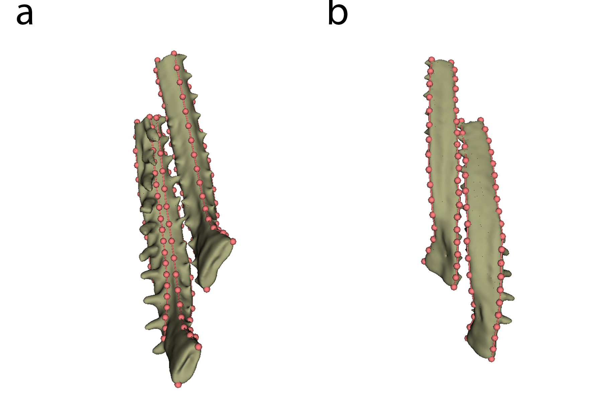

## Materials & Methods {.page_break_before}

{#fig:workflow}

### Sample procurement and preparation

The specimens used for this study were collected from source lakes as part of the FITNESS project in the region of Cook Inlet, Alaska.
Fish were collected using unbaited minnow traps in two separate field seasons, the first taking place from May 26–June 10, 2023 and the second taking place from May 25–June 11, 2024.
Specimen collections were collected from a random sample of up to 30 fish from each lake, under Alaska Department of Fish and Game (ADFG) permits SF2023-030 and P-24-015 for 2023 and 2024, respectively.
Fish were euthanized with MS-222, photographed, labeled and preserved in 10% formalin in individual bags, all under Animal Use Protocol (AUP) MCGL-8265.
At the end of each field season, samples were shipped from Anchorage (AK, USA) to Bern (BE, CH) where they were stored until scanning. 
The total number of fish for each lake are: Finger lake (66), Spirit lake (41), Watson lake (52), Walby lake (20), Tern lake (26) for a total of 251 specimens.
As an additional step, fish collected in the 2024 field season had DNA fin clips taken via a small piece of the caudal fin in order to sex each individual. Samples underwent hotshot DNA extraction protocol [doi:10.2144/000112619] and subsequent PCR followed Stickleback LRRc61 Sexing with primers for this purpose (see Archeambeault et al., 2020 [doi:10.1002/evl3.175])

Due to their inherent contrast difference to the surrounding tissue, the structures of interest in this study (teeth and bones, i.e., jaws and skull) are well visualized in unstained samples, hence no further preparation of the fish was necessary. 

### μCT imaging

In a small pilot study, we determined the optimal scanning parameters to meet the constraints on total scanning time, resolution, and sample handling.
To optimize for these constraints, we scanned all the sticklebacks in batches of six fish in a custom-made 3D printed sample holder in a single scan.
This holder was designed in [OpenSCAD](https://openscad.org/) (OpenSCAD Developers. Version 2021.01) and is available online, either directly as [STL file for printing](https://github.com/TomoGraphics/Hol3Drs/blob/master/STL/Stickleback.Multiple.stl) or as [(parameterized) OpenSCAD file](https://github.com/TomoGraphics/Hol3Drs/blob/master/Stickleback.Multiple.scad) for adaptation to other classes of samples.
Both files are part of a library of 3D-printable sample holders for tomographic imaging [@doi:10.5281/zenodo.2587555].

Tomographic imaging was performed on a [Bruker SkyScan 2214](https://www.bruker.com/en/products-and-solutions/diffractometers-and-x-ray-microscopes/3d-x-ray-microscopes/skyscan-2214.html) (Bruker microCT, Kontich, Belgium) at the Institute of Anatomy, University of Bern, Switzerland.
In total, we performed 44 scans, each scan usually containing six fish in the sample holder.

The relevant details of each scan are summarized in a table in the [Supplementary Materials]; a short overview of the scanning parameters is given below.
The X-ray source was set to a voltage of 60 kV and a current of around 110 µA for all but one scan where we used a source voltage of 49 kV and 159 µA due to operator error.
For each sample, we recorded a set of 3601 projections of approximately 3000 x 2000 pixels at 0.1° intervals over a 360° sample rotation.
Every single projection was exposed for about a second (depending on the sample).
Because of the length of the fish, we had to acquire so-called stacked scans, on average we scanned 3 fields of view along the rotation axis of the sample holder.
This resulted in scan times between 3 to 5 hours.
The projection images were then subsequently reconstructed into stacks of 8bit PNG images with NRecon (Bruker microCT, Kontich, Belgium. Version: 2.1.0.1 or 2.2.0.6), without applying any ring artefact or beam hardening correction.
The isometric voxel sizes in the resulting datasets vary from 15 to 19 µm.

### Data analysis

#### Preparation and handling of tomographic datasets

After acquisition, [a simple script](https://github.com/habi/sticklebacks/blob/main/rsync-sticklebacks.sh) was used to copy the relevant data to both archival storage and storage accessible by all co-authors.
Further processing of the tomographic dataset was performed with a set of Jupyter [@doi:10.3233/978-1-61499-649-1-87] notebooks [@doi:10.5281/zenodo.18257528].

##### Preview notebook

The [preview notebook](https://nbviewer.org/github/habi/sticklebacks/blob/main/PreviewScans.ipynb) is used to identify issues with the scanning.
For this, we read all relevant scanning and reconstruction parameters from the log files of each scan.
Afterwards, we efficiently loaded the reconstruction PNG images from disk with the [`dask_image.imread.imread`](https://image.dask.org/en/latest/dask_image.imread.html) function [@dask].
This approach allowed us to map *all* the reconstructions to memory and quickly generate maximum intensity projections (MIP) of each scan (see Figure @fig:mips for an example) for both quality control and further processing.

{#fig:mips}

##### Separation notebook

The [separation notebook](https://nbviewer.org/github/habi/sticklebacks/blob/main/BucketSeparator.ipynb) processes all the acquired scans to extract each individual fish from each scan encompassing six fish in total.
As in the preview notebook, we efficiently load all the PNGs from disk with [`dask`](https://www.dask.org/) [@dask].
Based on the previously extracted MIP images and a simple labeling of these images ([`skimage.measure.label`](https://scikit-image.org/docs/stable/api/skimage.measure.html#skimage.measure.label)), we extract both the labels in the custom-made sample holder and the positions of individual fish in the scan ([`skimage.measure.regionprops`](https://scikit-image.org/docs/stable/api/skimage.measure.html#skimage.measure.regionprops)) (see Figure @fig:labels).
This extraction is completely reproducible and well-adapted to the custom-made sample holder.

{#fig:labels}

Based on a simple mapping of the detected region to the ID numbers of the scanned fish, we labeled the resulting images and presented these images together with photos of the lab book and sample tubes for verification (see Figure @fig:checking).

{#fig:checking}

The `skimage.measure.regionprops` function used for labeling not only returns the positions of each detected fish, but also the extent of the bounding box of each detected region.
We extracted each region of each fish separately out of the large reconstructions (with a configurable border buffer, see Figure @fig:cropping) and wrote these extracted regions to disk in discrete folders for efficient further analysis.
In a first step, we wrote the regions of the single fish to disk in `zarr` [@doi:10.5281/zenodo.3773450] format, which is a preferred format to store n-dimensional arrays on disk.
In addition to this, we also wrote a log file for each extracted region, containing all relevant information to redo the cropping step completely manually (an [example of such a log file](https://github.com/habi/sticklebacks/blob/main/logfiles/BucketOfFish_H/rec_regions/SL.X23.016/SL.X23.016.log) is shown as part of the processing repository).

{#fig:cropping}

Writing the regions as `zarr` files made it possible to efficiently work with the image data of each extracted fish and to convert that data to any desired format for further analysis.
For this further analysis, we also wrote stacks of PNG images and, additionally, [`NRRD`](https://teem.sourceforge.net/nrrd/) files for each fish region in both cropped and cropped-and-binarized forms.
These binarized regions were segmented into bone and background based on a simple multi-level Otsu thresholding method [@doi:10.6688/JISE.2001.17.5.1].
Providing the regions as `NRRD` files helped to efficiently work with the datasets as specified in the following sections.

Using `K3D-jupyter` [@url:https://k3d-jupyter.org] we implemented a quick way to view any of the extracted regions directly in the Jupyter notebook (see Figure @fig:k3d).
An [interactive version of this figure](https://htmlpreview.github.io/?https://raw.githubusercontent.com/habi/sticklebacks-manuscript/refs/heads/main/content/data/SL.X23.012.3D.html) is available online.

{#fig:k3d}

#### Extraction of features of interest

After separation, the cropped image files were checked and rendered using 3D Slicer [@doi:10.1007/978-1-4614-7657-3_19] and the SlicerMorph extension [@doi:10.1111/2041-210X.13669].
The individual elements of the branchial apparatus were rendered using a combination of thresholding and 'Split Islands' tools to separate the pharyngobranchials, epibranchials, basibranchials, hypobranchials and ceratobranchials (see Figure @fig:branchial_anatomy).

{#fig:branchial_anatomy}

Once rendered, these bones were exported as a colored labelmap alongside the `NRRD` file from which they were segmented to pass to the Biomedisa program.

#### Machine learning and model training

As a group, a dataset of 51 specimens (including `NRRD` and `.label` files) was passed to Biomedisa [@doi:10.1038/s41467-020-19303-w] to train a segmentation model.
We allowed for rotation of 180° to account for possible specimen variability, and an 80/20 split between training and validation data.
The model was trained with a batch size of 24 and 50 epochs, using a network architecture of 32-64-128-256-512. The final model performs well, with a dice score of 0.9159 on the validation dataset. Manual touchups were only needed and performed where bones were extremeley close together (causing their appearance to be "stuck" in the final render; this is an issue with manual segementation as well). 

#### Landmarking of models

To demonstrate the effectiveness of this tool and the importance of 3D morphometrics for answering eco-evolutionary questions, we have run a demonstration quantifying the shape differences of the ceratobranchial bones.
Once trained, we applied the Biomedisa segmentation model to the remaining 160 specimen volumes and landmarked the final results using Stratovan Checkpoint [@checkpoint].
As a test and for subsequent analysis, the first and second right ceratobranchials were chosen for comparison across all specimens.
Type II landmarks were set on the ends of each bone, with semilandmarks in-between each to cover axes of curvature along the bone (see Figure @fig:landmarks).
In total, 7 landmarks and 4 semilandmark curves (two containing 20 semilandmarks, two containing 15) were placed on the first ceratobranchial (CB1), and 5 landmarks and 3 semilandmark curves (one containing 20 semilandmarks, two containing 15) were placed on the second ceratobranchial (CB2).
Equal distances were ensured using the `resample_curves` function in 3D Slicer.

{#fig:landmarks}

#### Analysis of shape

All subsequent analyses were run using R (version 4.4.1, [@r]) and the geomorph package [@doi:10.1111/2041-210X.12035].
Both bones were split and analyzed separately after generalized Procrustes analysis (GPA) using the [`gpagen()`](https://search.r-project.org/CRAN/refmans/geomorph/html/gpagen.html) function, with Principal Component Analysis (PCA) and linear models run with [`gm.prcomp()`](https://search.r-project.org/CRAN/refmans/geomorph/html/gm.prcomp.html) and [`procD.lm()`](https://search.r-project.org/CRAN/refmans/geomorph/html/procD.lm.html), respectively.
Linear fits were further investigated via the `pairwise()` function to analyze differences in pairwise statistics.
