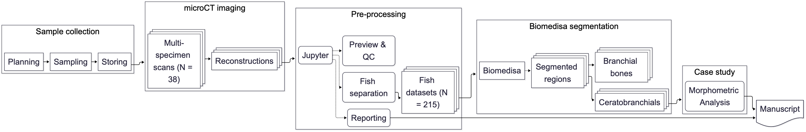
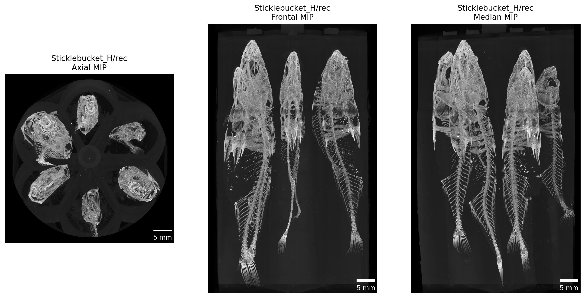
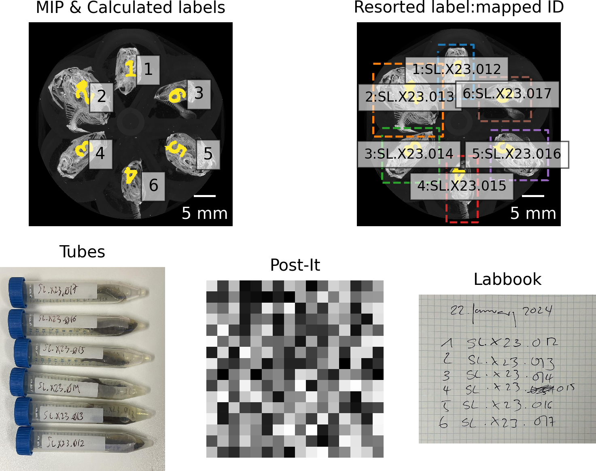
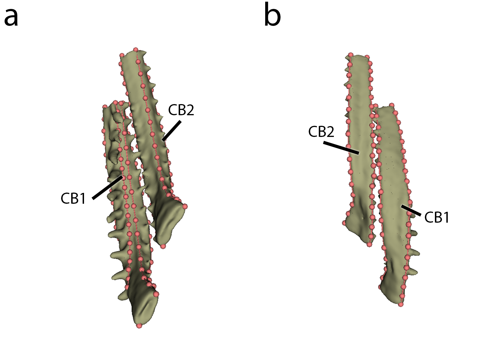

## Materials & Methods {.page_break_before}

{#fig:workflow}

### Sample Procurement and Preparation

The samples used for this study were collected from six of the eight source lakes used for the FITNESS project in the region of Cook Inlet, Alaska.
Fish were collected using unbaited minnow traps in two separate field seasons, the first from May 26--June 10, 2023 and the second from May 25--June 11, 2024.
Specimens were collected from a random sample of up to 30 fish from each lake, under Alaska Department of Fish and Game (ADFG) permits SF2023-030 and P-24-015 for 2023 and 2024, respectively.
The fish were sacrificed with MS-222, photographed, labeled and preserved in 10% formalin in individual bags, all under McGill University Animal Use Protocol (AUP) MCGL-8265.
At the end of each field season, samples were shipped from Anchorage (AK, USA) to Bern (BE, CH), where they were stored until scanning.
The total number of fish for each lake was: 52 from Watson Lake (benthic), 48 from Finger Lake (benthic), 46 from Spirit Lake (limnetic), 35 from South Rolly Lake (limnetic), 20 from Walby Lake (benthic), and 14 from Tern Lake (benthic) for a total of 215 specimens.
Additionally, caudal fin clips were collected from fish sampled during the 2024 field season for molecular sex identification through genotyping.
DNA was extracted from fin tissue following Meeker et al. [@doi:10.2144/000112619], and subsequent PCR genotyping with LRRc61 primers was performed, following Archambeault et al. [@doi:10.1002/evl3.175].

Due to their inherent contrast difference with the surrounding tissue, the structures of interest in this study (teeth and bones, i.e., jaws and skull) are well visualized in unstained samples, so no further preparation of the fish was necessary.

### Micro-CT Imaging

In a pilot study, we identified optimal scanning parameters to meet the constraints on total scanning time, resolution, and sample handling.
To optimize for these constraints, we scanned all sticklebacks in batches of six fish in a custom-made 3D-printed sample holder in a single scan.
This holder was designed in [OpenSCAD](https://openscad.org/) (OpenSCAD Developers. Version 2021.01) and is available online, either directly as [STL file for printing](https://github.com/TomoGraphics/Hol3Drs/blob/master/STL/Stickleback.Multiple.stl) or as [(parameterized) OpenSCAD file](https://github.com/TomoGraphics/Hol3Drs/blob/master/Stickleback.Multiple.scad) for adaptation to other classes of samples.
Both files are part of a library of 3D-printable sample holders for tomographic imaging [@doi:10.5281/zenodo.2587555].

Tomographic imaging was performed on a [Bruker SkyScan 2214](https://www.bruker.com/en/products-and-solutions/diffractometers-and-x-ray-microscopes/3d-x-ray-microscopes/skyscan-2214.html) (Bruker microCT, Kontich, Belgium) at the Institute of Anatomy, University of Bern, Switzerland.
In total, we performed 38 scans, each scan usually containing up to six fish in the sample holder.

The relevant details of each scan are summarized in a table in the [Supplementary Materials]; a short overview of the scanning parameters is given below.
The X-ray source was set to a voltage of 60 kV and a current of around 110 µA for all scans except one, where we used a source voltage of 49 kV and 159 µA due to operator error.
For each sample, we recorded a set of 3601 projections (each with a size of 3000 by 2000 pixels) at 0.1° intervals over a 360° sample rotation.
Every single projection was exposed for about a second.
Because of the length of the fish, we had to acquire so-called stacked scans; on average, we scanned 3 fields of view along the rotation axis of the sample holder.
This resulted in an average scan time of 10 hours for each scan.
The projection images were then subsequently reconstructed into stacks of 8-bit `png` images with NRecon (Bruker microCT, Kontich, Belgium. Version: 2.2.0.6), without applying any ring artifact or beam hardening correction.
The isometric voxel sizes in the resulting datasets vary from 15 to 17.5 µm.

The result of one such multi-specimen scan is visualized in Figure @fig:visualization, where it is shown how this scan contains six fish.
The labels on the holder are colored red and are shown extracted (in yellow) later in Figure @fig:labels.

{#fig:visualization}

### Data Analysis

#### Preparation and Handling of Tomographic Datasets

After acquisition, [a simple script](https://github.com/habi/sticklebacks/blob/main/rsync-sticklebacks.sh) was used to copy the relevant data to both archival storage and storage accessible by all coauthors.
Further processing of the tomographic dataset was performed with a set of Jupyter [@doi:10.3233/978-1-61499-649-1-87] notebooks [@doi:10.5281/zenodo.18257528].

##### Preview Notebook

The [preview notebook](https://nbviewer.org/github/habi/sticklebacks/blob/main/PreviewScans.ipynb) is used to identify scanning and reconstruction issues.
For this, we read all the relevant scan and reconstruction parameters from the log files of each scan.
Afterwards, we efficiently loaded the reconstruction `png` images from disk with the [`dask_image.imread.imread`](https://image.dask.org/en/latest/dask_image.imread.html) function [@dask].
This approach allowed us to map *all* the reconstructions to memory and quickly generate maximum intensity projections (MIP) of each scan (see Figure @fig:mips for an example) for both quality control and further processing.

{#fig:mips}

##### Separation Notebook

The [separation notebook](https://nbviewer.org/github/habi/sticklebacks/blob/main/BucketSeparator.ipynb) processes all the acquired scans to extract each individual fish from each scan that encompasses six fish in total.
As in the preview notebook, we efficiently load all the `png`s from disk with [`dask`](https://www.dask.org/) [@dask].
Based on the previously extracted MIP images and a simple labeling of these images ([`skimage.measure.label`](https://scikit-image.org/docs/stable/api/skimage.measure.html#skimage.measure.label)), we extract both the labels in the custom-made sample holder and the positions of individual fish in the scan ([`skimage.measure.regionprops`](https://scikit-image.org/docs/stable/api/skimage.measure.html#skimage.measure.regionprops)) (see Figure @fig:labels).
This extraction process is fully reproducible and is tailored to the arrangement of the samples in the custom sample holder.

{#fig:labels}

Based on a simple mapping of the detected region to the ID numbers of the scanned fish, we labeled the resulting images and presented these images together with photos of the lab book and sample tubes for verification (see Figure @fig:checking).

{#fig:checking}

The `skimage.measure.regionprops` function used for labeling returns not only the positions of each detected fish but also the extent of the bounding box of each detected region.
We extracted each region of each fish separately from the large reconstructions (with a configurable border buffer; see Figure @fig:cropping) and wrote these extracted regions to disk in discrete folders for efficient further analysis.
In a first step, we wrote the regions of the single fish to disk in `zarr` [@doi:10.5281/zenodo.3773450] format, which is a preferred format to store n-dimensional arrays on disk.
In addition to this, we also wrote a log file for each extracted region, containing all relevant information to redo the cropping step manually in any image processing software.
All these log files are also available in the processing repository, an [example of such a log file (from the region shown in Figure @fig:SLX23012_3D) is shown here](https://github.com/habi/sticklebacks/blob/main/logfiles/BucketOfFish_H/rec_regions/SL.X23.016/SL.X23.016.log).

{#fig:cropping}

Writing the regions as `zarr` files made it possible to work efficiently with the image data of each extracted fish and to convert those data to any desired format for further analysis.
For this further analysis, we also wrote stacks of `png` images and, additionally, [`nrrd`](https://teem.sourceforge.net/nrrd/) files for each fish region in both cropped and cropped-and-binarized forms.
These binarized regions were segmented into bone and background based on a simple multi-Otsu thresholding algorithm [@doi:10.6688/JISE.2001.17.5.1], (with 4 classes, using only the middle threshold).
Providing the regions as `nrrd` files helped to efficiently work with the datasets as specified in the following sections.

Using either `K3D-jupyter` [@url:https://k3d-jupyter.org] or `napari` [@doi:10.5281/zenodo.3555620], we implemented a quick way to view any of the extracted regions directly in the Jupyter notebook.
`K3D-jupyter` allows saving an interactive version of the preview.
One such interactive preview is [available online](https://htmlpreview.github.io/?https://raw.githubusercontent.com/habi/sticklebacks-manuscript/refs/heads/main/content/data/SL.X23.012.3D.html).
`napari` is well suited to load the intermediately generated `*.zarr` files; Figure @fig:SLX23012_3D shows such a preview.

{#fig:SLX23012_3D}

#### Extraction of Features of Interest

After separation, the cropped image files were checked and rendered using 3D Slicer [@doi:10.1007/978-1-4614-7657-3_19] and the SlicerMorph extension [@doi:10.1111/2041-210X.13669].
Individual elements of the branchial apparatus were rendered using a combination of thresholding and ‘Split Islands’ tools to separate the pharyngobranchials, epibranchials, basibranchials, hypobranchials, and ceratobranchials (see Figure @fig:branchial_anatomy).

{#fig:branchial_anatomy}

Once rendered, these bones were exported as a colored labelmap along with the `nrrd` file from which they were segmented to pass to the Biomedisa program.

#### Machine Learning and Model Training

We passed a dataset of 51 samples (including `nrrd` and `label` files) to Biomedisa [@doi:10.1038/s41467-020-19303-w] to train a segmentation model.
We allowed a 180° rotation to account for possible specimen variability, with an 80/20 split between training and validation data.
The model was trained with a batch size of 24 and 50 epochs, using a network architecture of 32-64-128-256-512.
The final model performs well, with a dice score of 0.9159 on the validation dataset.
We only performed manual touch-ups where the adjacent bones were in close proximity (causing their appearance to be 'stuck' in the final render; this is also an issue with manual segmentation and not exclusive to the approach described below).

#### Landmarking of Models

To demonstrate the effectiveness of this tool and the importance of 3D morphometry to answer evolutionary questions, we quantified the shape differences of the ceratobranchial bones.
Once trained, we applied the Biomedisa segmentation model to the remaining 160 specimens and landmarked the final results using Stratovan Checkpoint [@checkpoint].
As a test and for subsequent analysis, the first and second right ceratobranchials were chosen for comparison between all samples.
Type II landmarks were placed at the ends of each bone, with semi-landmarks between each to cover the curvature axes along the bone (see Figure @fig:landmarks).
In total, 7 landmarks and 4 semilandmark curves (two containing 20 semilandmarks, two containing 15) were placed on the first ceratobranchial (CB1), and 5 landmarks and 3 semilandmark curves (one containing 20 semilandmarks, two containing 15) were placed on the second ceratobranchial (CB2).
Equal distances were ensured using the `resample_curves` function in 3D Slicer.

{#fig:landmarks}

#### Analysis of Shape

All subsequent analyses were run using R (version 4.4.1, [@r]) and the geomorph package [@doi:10.1111/2041-210X.13723; @doi:10.32614/CRAN.package.geomorph; @doi:10.32614/CRAN.package.RRPP; @doi:10.1111/2041-210X.13029].
Both bones were split and analyzed separately after generalized Procrustes analysis (GPA) using the [`gpagen()`](https://search.r-project.org/CRAN/refmans/geomorph/html/gpagen.html) function, with Principal Component Analysis (PCA) and linear models run with [`gm.prcomp()`](https://search.r-project.org/CRAN/refmans/geomorph/html/gm.prcomp.html) and [`procD.lm()`](https://search.r-project.org/CRAN/refmans/geomorph/html/procD.lm.html), respectively.
Linear fits were further investigated using the `pairwise()` function to analyze differences in pairwise statistics.
