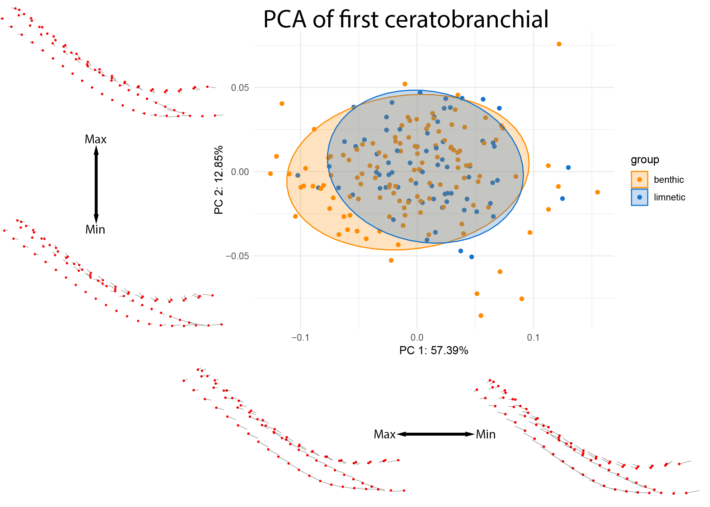
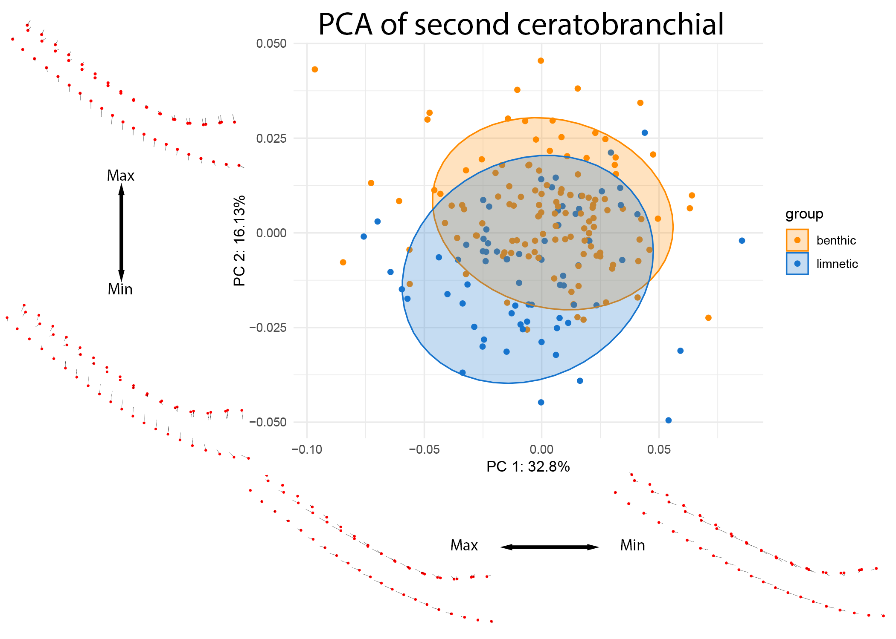
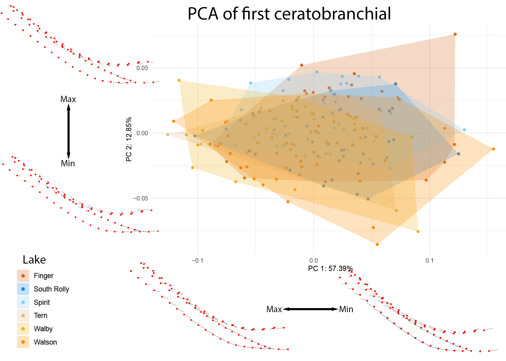
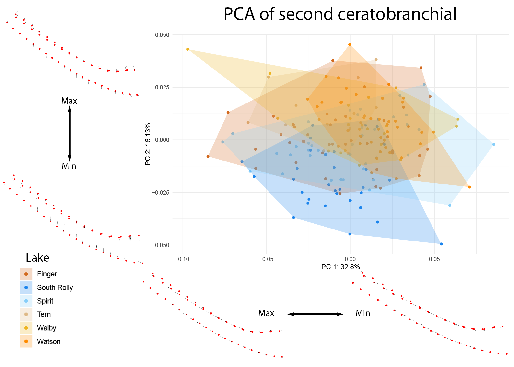

## Results {.page_break_before}

### μCT data

<!-- Let's try it here - after all, it is technically a result of your work! -->
Acquisition and reconstruction of fish proved successful and efficient.
216 unique specimens were scanned in a total scanning duration of 18 days, 12 hours and 6 minutes.
We acquired 158444 projections, reconstructed into a total of 177749 reconstructions, to about 4040 files per scan (N=44).
The total size of this sampling effort is ~44 GB of `.zarr` files, ~64 GB of `.nrrd` files

### Fish separation

Our method reproducibly extracts each of the 6 fish scanned simultaneously in one scan.
The custom-made sample holder aligns the single fish in the vertical axis around the rotation axis of the tomographic scan.
The extraction based on the MIP image along the rotation axis is completely automated and very robust, since the detected fish 'regions' do not overlap in the resulting image.

Depending on the available machine it would even not be possible to load the full stack of each scan into a software to manually perform the cropping, such as Fiji [@doi:10.1038/nmeth.2019].
Large stacks of images (in other words larger than the RAM of the available machine) can be loaded as 'virtual stacks', but to manually crop the region of each fish from the large scan with the [Crop (3D)](https://www.longair.net/edinburgh/imagej/three-pane-crop/) function, one needs to load the full dataset.
Since one (exemplary dataset (`Sticklebucket_10`)) is 7 GB on disk and reported as being 35.4 GB when loaded in Fiji, using the 3D cropping function on an uncropped single dataset is not possible without using a powerful workstation.

Extracting the single fish from the encompassing dataset would thus be a two-step manual process, e.g. cropping the full dataset loaded as '[virtual stack](https://imagej.net/ij/docs/guide/146-8.html#sub:Virtual-Stacks)' and then cropping it down further before writing out the cropped stack.
For each encompassing scan this would need to be repeated 6 times (for *each* of the 6 fish in each of the encompassing scans).
In addition, such a manual process is not reproducible in the sense that it cannot be consistently replicated by others using the same data since the manual cropping is operator-dependent.
Algorithmically/automatically cropping the large datasets based on the axial MIP image leads to both reproducible cropped regions and efficiently uses the operator time (namely *no* operator time) {#tbl:timing}.

| Task                            | Est. Manual Time [min] | Pipeline Time [min] |
|---------------------------------|------------------------|---------------------|
| Scanning single scan            | #                      | ##                  |
| Splitting and rendering volumes | #                      | ##                  |
| Segmentation                    | 10-15                  | 2-3                 |

Table: Estimates of time comparisons between manual and pipeline runs. {#tbl:timing}

Our automated extraction process also writes human-readable log files documenting the cropping position in the encompassing dataset and the crop extent.
This enables reproducible double-checking and confirmation of the process after the fact (see this [direct link for one such log file](https://github.com/habi/sticklebacks/blob/main/logfiles/Sticklebucket_10/rec_regions/FG.X24.027/FG.X24.027.log)).

### Thresholding

The separated fish were segmented based on a simple multi-level Otsu thresholding method.
This relatively simple segmentation was sufficient to extract all the features we analyzed further, and we did not have to employ more advanced thresholding methods in our separation pipeline.
Selection and individual rendering of the branchial structures takes between 10-15 minutes; the average Biomedisa render takes 2.5 minutes once trained {#tbl:timing}.

<!-- Did Sheila even analyze the thresholded fish, or "only" the cropped ones? She focused on the cropped ones.-->

### Analysis

The speed and quality of these data allow us to study the internal branchial anatomy at scale and in situ, without the need for fine dissection.

Numerous studies have shown the relationships between gill rakers (bony protrusions off of the branchial complex) and diet [@doi:10.1086/285404; @doi:10.1111/j.1420-9101.2008.01583.x]

While the shape and arrangement of the ceratobranchials and the corresponding bony gill rakers are hypothesized to work in tandem for food processing and water vortex generation during suspension feeding [@doi:10.1371/journal.pone.0193874], the shape of these bones have received comparatively little attention.

This is likely due to the flattening and destructive sampling used in traditional raker counting methods, which dissect and deform these structures to render them visible for manual measurement.
3D analyses preserve these features at a high resolution.

After GPA alignment, we are able to quantify the shape differences among all fish scanned for this project.
Changes due to allometry (using the metric of centroid size or standard length of the fish) were significant, but slight: explaining only a small fraction of shape variation in both bones.
Both linear models and PCA results suggest that the lakes themselves - and not overarching categories of ecotype or sex - drive most of the shape variation in these bones (CB1: p = .001, Rsq = 0.03246, CB2: p =.001, Rsq = .06220).
The ecological variation present across the first ceratobranchial shows a significant but quite small effect with lake origin (p = .009, Rsq = 0.02056 ), and with a large amount of overlap in the resulting shape space #fig:pca_cb1.

{#fig:pca_cb1}

The second ceratobranchial bone, on the other hand, shows equally small yet significant shifts associated with the ecotype (p = .001, Rsq = 0.0377).
The pattern of difference between benthic and limnetic gill rakers are, for this bone, clearly divergent in shape space #fig:pca_cb2.

{#fig:pca_cb2}

These differences in ecological patterning were also broken down by lake (#fig:pca_cb1_lake, #fig:pca_cb2_lake).

{#fig:pca_cb1_lake}

{#fig:pca_cb2_lake}

The differences in the 2nd ceratobranchial appear to be driven by divergence in the South Rolly population, supported by significant pairwise differences observed between this lake and all other lakes observed in CB2 and not in CB1 (see supplementary information).
After GPA alignment, we are able to quantify the shape differences among all fish scanned for this project.
Changes due to allometry (using the metric of centroid size or standard length of the fish) were significant, but slight: explaining only a small fraction of shape variation in both bones.
