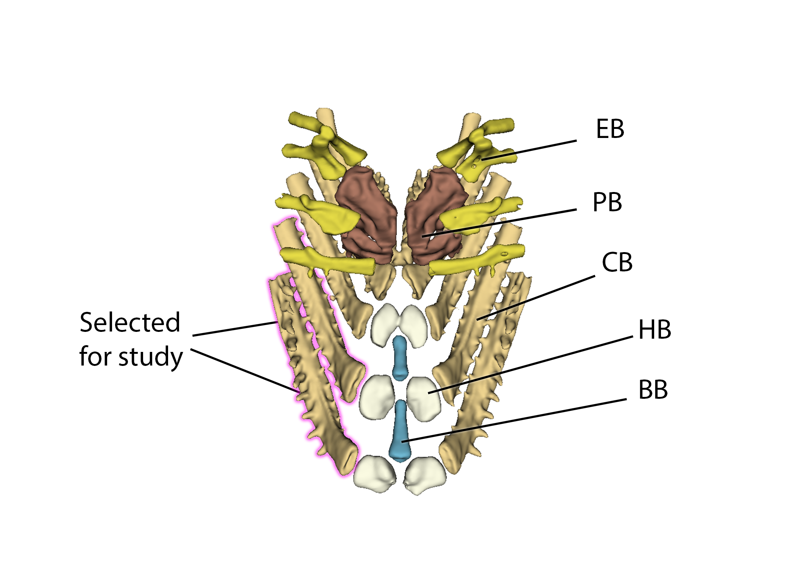

---
title: microCT imaging of threespine stickleback
keywords:
- tomography
- sticklebacks
- ecology
lang: en-US
date-meta: '2026-07-01'
author-meta:
- David Haberthür
- Ben Sulser
- Sheila Christen
- Catherine L. Peichel
- Ruslan Hlushchuk
header-includes: |
  <!--
  Manubot generated metadata rendered from header-includes-template.html.
  Suggest improvements at https://github.com/manubot/manubot/blob/main/manubot/process/header-includes-template.html
  -->
  <meta name="dc.format" content="text/html" />
  <meta property="og:type" content="article" />
  <meta name="dc.title" content="microCT imaging of threespine stickleback" />
  <meta name="citation_title" content="microCT imaging of threespine stickleback" />
  <meta property="og:title" content="microCT imaging of threespine stickleback" />
  <meta property="twitter:title" content="microCT imaging of threespine stickleback" />
  <meta name="dc.date" content="2026-07-01" />
  <meta name="citation_publication_date" content="2026-07-01" />
  <meta property="article:published_time" content="2026-07-01" />
  <meta name="dc.modified" content="2026-07-01T09:28:21+00:00" />
  <meta property="article:modified_time" content="2026-07-01T09:28:21+00:00" />
  <meta name="dc.language" content="en-US" />
  <meta name="citation_language" content="en-US" />
  <meta name="dc.relation.ispartof" content="Manubot" />
  <meta name="dc.publisher" content="Manubot" />
  <meta name="citation_journal_title" content="Manubot" />
  <meta name="citation_technical_report_institution" content="Manubot" />
  <meta name="citation_author" content="David Haberthür" />
  <meta name="citation_author_institution" content="microCT research group, Institute of Anatomy, University of Bern, Baltzerstrasse 2, 3012 Bern, Switzerland" />
  <meta name="citation_author_orcid" content="0000-0003-3388-9187" />
  <meta name="citation_author" content="Ben Sulser" />
  <meta name="citation_author_institution" content="Evolutionary Ecology Group, Institute of Ecology and Evolution, University of Bern, Baltzerstrasse 6, 3012 Bern, Switzerland" />
  <meta name="citation_author_orcid" content="0000-0002-8750-0942" />
  <meta name="citation_author" content="Sheila Christen" />
  <meta name="citation_author" content="Catherine L. Peichel" />
  <meta name="citation_author_institution" content="Division of Evolutionary Ecology, Institute of Ecology and Evolution, University of Bern, Baltzerstrasse 6, 3012 Bern, Switzerland" />
  <meta name="citation_author_orcid" content="0000-0002-7731-8944" />
  <meta name="citation_author" content="Ruslan Hlushchuk" />
  <meta name="citation_author_institution" content="microCT research group, Institute of Anatomy, University of Bern, Baltzerstrasse 2, 3012 Bern, Switzerland" />
  <meta name="citation_author_orcid" content="0000-0001-2345-6789" />
  <link rel="canonical" href="https://habi.github.io/sticklebacks-manuscript/" />
  <meta property="og:url" content="https://habi.github.io/sticklebacks-manuscript/" />
  <meta property="twitter:url" content="https://habi.github.io/sticklebacks-manuscript/" />
  <meta name="citation_fulltext_html_url" content="https://habi.github.io/sticklebacks-manuscript/" />
  <meta name="citation_pdf_url" content="https://habi.github.io/sticklebacks-manuscript/manuscript.pdf" />
  <link rel="alternate" type="application/pdf" href="https://habi.github.io/sticklebacks-manuscript/manuscript.pdf" />
  <link rel="alternate" type="text/html" href="https://habi.github.io/sticklebacks-manuscript/v/711e841722d3af3976b9e1f28a7b1a1e55cba757/" />
  <meta name="manubot_html_url_versioned" content="https://habi.github.io/sticklebacks-manuscript/v/711e841722d3af3976b9e1f28a7b1a1e55cba757/" />
  <meta name="manubot_pdf_url_versioned" content="https://habi.github.io/sticklebacks-manuscript/v/711e841722d3af3976b9e1f28a7b1a1e55cba757/manuscript.pdf" />
  <meta property="og:type" content="article" />
  <meta property="twitter:card" content="summary_large_image" />
  <link rel="icon" type="image/png" sizes="192x192" href="https://manubot.org/favicon-192x192.png" />
  <link rel="mask-icon" href="https://manubot.org/safari-pinned-tab.svg" color="#ad1457" />
  <meta name="theme-color" content="#ad1457" />
  <!-- end Manubot generated metadata -->
bibliography:
- content/manual-references.bib
manubot-output-bibliography: output/references.json
manubot-output-citekeys: output/citations.tsv
manubot-requests-cache-path: ci/cache/requests-cache
manubot-clear-requests-cache: false
...

<small><em>
This manuscript
([permalink](https://habi.github.io/sticklebacks-manuscript/v/711e841722d3af3976b9e1f28a7b1a1e55cba757/))
was automatically generated
from [habi/sticklebacks-manuscript@711e841](https://github.com/habi/sticklebacks-manuscript/tree/711e841722d3af3976b9e1f28a7b1a1e55cba757)
on July 1, 2026.
</em></small>

## Authors

+ **David Haberthür**
   
    {.inline_icon width=16 height=16}
    [0000-0003-3388-9187](https://orcid.org/0000-0003-3388-9187)
    · {.inline_icon width=16 height=16}
    [habi](https://github.com/habi)
    · {.inline_icon width=16 height=16}
    [\@habi@mastodon.social](https://mastodon.social/@habi)
     
  <small>
     microCT research group, Institute of Anatomy, University of Bern, Baltzerstrasse 2, 3012 Bern, Switzerland
  </small>

+ **Ben Sulser**
   
    {.inline_icon width=16 height=16}
    [0000-0002-8750-0942](https://orcid.org/0000-0002-8750-0942)
    · {.inline_icon width=16 height=16}
    [sulserrb](https://github.com/sulserrb)
     
  <small>
     Evolutionary Ecology Group, Institute of Ecology and Evolution, University of Bern, Baltzerstrasse 6, 3012 Bern, Switzerland
     · Funded by Bern Burgergemeinde
  </small>

+ **Sheila Christen**
   
  <small>
  </small>

+ **Catherine L. Peichel**
   
    {.inline_icon width=16 height=16}
    [0000-0002-7731-8944](https://orcid.org/0000-0002-7731-8944)
    · {.inline_icon width=16 height=16}
    [cpeichel](https://github.com/cpeichel)
     
  <small>
     Division of Evolutionary Ecology, Institute of Ecology and Evolution, University of Bern, Baltzerstrasse 6, 3012 Bern, Switzerland
     · Funded by Swiss National Science Foundation (TMAG-3_209309/1)
  </small>

+ **Ruslan Hlushchuk**
  ^[✉](#correspondence)^ 
    {.inline_icon width=16 height=16}
    [0000-0001-2345-6789](https://orcid.org/0000-0001-2345-6789)
    · {.inline_icon width=16 height=16}
    [RuslanHlushchuk](https://github.com/RuslanHlushchuk)
     
  <small>
     microCT research group, Institute of Anatomy, University of Bern, Baltzerstrasse 2, 3012 Bern, Switzerland
  </small>

::: {#correspondence}
✉ — Correspondence possible via [GitHub Issues](https://github.com/habi/sticklebacks-manuscript/issues)
or email to
Ruslan Hlushchuk \<ruslan.hlushchuk@unibe.ch\>.

:::

## Abstract {.page_break_before}

Can we predict evolution?

The three-spined stickleback (Gasterosteus aculeatus) is a well-recognized system for understanding adaptation to divergent habitats.
Populations of benthic (benthos-feeding) and limnetic (water-column feeding) stickleback differ in a number of phenotypic traits that are associated with shifts in dietary specialization.
Modern investigation of the evolutionary changes in this organism often requires the analysis of hundreds, if not thousands, of individuals.
However, analyses of the structures required for feeding – especially the jaws and complex internal branchial anatomy — require considerable time and expertise, with destructive sampling and fine dissection skills needed for quantitative analysis.

The advent of X-ray microtomography and 3D-scanning technology affords non-destructive sampling and an increases the amount of high-resolution data available for study, but at the substantial cost of increasing complexity and processing time for each specimen such that these techniques are often unfeasible for studies of eco-evolutionary scale.

To address these concerns, we developed a rapid and semi-automated segmentation and analysis pipeline based on both the Jupyter interactive development environment and the Biomedisa image segmentation platform for investigating three-dimensional morphological adaptation within the three-spined stickleback.

The pipeline includes splitting multi-specimen scans into regions of interest for each specimen, reconstruction of targeted anatomy, and morphometric analyses.
We then applied this pipeline to a sampling effort comprising 44 multi-specimen scans representing 216 specimens of divergent benthic and limnetic stickleback populations, showcasing the possibility of using high-throughput scanning data to provide tests of ecological and evolutionary hypotheses.

## Introduction {.page_break_before}

The three-spined stickleback (Gasterosteus aculeatus) is an oft-studied organism for understanding the independent evolution of similar traits in similar environments [@doi:10.1093/oso/9780198577287.001.0001; @doi:10.1146/annurev-genom-111720-081402].
This species exhibits marked differences in marine-freshwater, lake-stream, and benthic-limnetic ecotypes [@doi:10.1111/j.1095-8312.2010.01531.x].
This study will focus on the benthic-limnetic axis, using samples from a long-term evolutionary experiment currently investigating divergent populations of limnetic and benthic stickleback within the Kenai Peninsula of Alaska (USA) [@doi:10.1002/ece3.11503].
This project, the Forward In Time Natural Experimental Study of Selection (FITNESS), aims to study the predictability and repeatability of evolution.
Two pools of sticklebacks — one made from four source populations of limnetic and four source populations of benthic sticklebacks — have been placed into eight destination lakes, four of which are small and benthic and four of which are large and limnetic.
These new populations have been sampled every year in order to track the genotypic and phenotypic trajectories of these introduced populations.
Understanding the initial variation in the source populations is essential to this project, as this initial variation would be expected to reflect which phenotypes are associated with each ecotype under study.

Among these and other bony fish, differences in jaw structures are directly related to functional and kinematic differences between different ecotypes [@doi:10.1002/ece3.6929].
Benthic stickleback have modified jaws for enhanced suction force and hypertrophied epaxial muscles to aid in foraging on benthic invertebrates and by contrast, limnetic stickleback have modifications for larger jaw protrusions and quick strikes during ram feeding [@doi:10.1186/1471-2148-13-277].
The internal hyoid arch-branchial arch complex is an important structure implicated in diet and feeding ecology [@doi:10.1086/285404; @doi:10.1111/j.1420-9101.2008.01583.x].
While the shape and arrangement of paired ceratobranchial and pharyngobranchial bones within this complex aid food processing and water vortex generation during feeding [@doi:10.1371/journal.pone.0193874], the shape of these bones have received comparatively little attention relative to other aspects of dietary anatomy.
This is likely due to the flattening and destructive sampling used in traditional raker counting methods, which dissect and deform these structures to render them visible for manual measurement [@doi:10.3791/54056].
These structures are, however, difficult to study without full cranial dissection and corresponding distortion of the branchial anatomy.
3D analyses preserve these features at a high resolution.
This work is embedded within the [Genomics axis](https://alaskastickleback.com/genomics) of the [Alaska Stickleback Restoration Project](https://alaskastickleback.com/), with which Katie Peichel, Ben Sulser and Sheila Christen are affiliated.

## Micro-computed tomography

X-ray microtomography (μCT) is an indispensable tool to gain non-destructive insights into the inner structure of highly diverse samples, namely for specimens studied in the biomedical sciences [@doi:10.1186/s12915-020-0753-2].
Microtomographic imaging is ideally suited to non-destructively assess the morphology of different fish species [@doi:10.1093/iob/obad008], including the internal anatomy and small structures difficult to quantify without additional preparation.
While these structures can be rendered by hand by a skilled investigator, the time and cost required per-specimen is inefficient for the scale required via eco-evolutionary study and this requires destruction of the mandibular and cranial anatomy of the specimen.
This project aims to address these gaps, demonstrating a novel pipeline for rendering and auto-splitting of a multi-specimen scan for mass sampling, creating a dataset with consistent parameters that can be fed to downstream machine learning techniques [@doi:10.1038/s41467-020-19303-w] to aid in the segmentation of individual bony structures in each scan.
Once a Biomedisa model is trained, the entire pipeline runs from multi-specimen input to rendered structures for each specimen in a fraction of the time and resources used in traditional analysis.

## Materials & Methods {.page_break_before}

{#fig:workflow}

### Sample procurement and preparation

The specimens used for this study were collected from source lakes as a part of the FITNESS project in the region of Cook Inlet, Alaska.
Fish were collected using unbaited minnow traps in two separate field seasons, the first taking place from May 26–June 10 2023 and the second taking place from May 25–June 11 2024.
Specimen collections were taken from a random sample of 30 fish from each lake, under Alaska Department of Fish and Game (ADFG) permits SF2023-030 and P-24-015 for 2023 and 2024, respectively.
Fish were euthanized with MS-222, photographed, and preserved in 10% formalin in a bag with a specific label, under Animal Use Protocol (AUP) MCGL-8265.
At the end of each field season, samples were shipped from Anchorage (AK, USA) to Bern (BE, CH) where they were stored until scanning time.

Due to their inherent contrast difference to the surrounding tissue, the structures of interest in this study (teeth and bones, i.e., jaws and skull) are well visualized in unstained samples, hence no further preparation of the fish was necessary.

### μCT imaging

In a small pilot study, we determined the optimal scanning parameters to meet the constraints on total scanning time, resolution and sample handling.
To optimize for these constraints, we scanned all the sticklebacks in batches of 6 fish in a custom-made 3D printed sample holder in a single scan.
This holder was generated with [OpenSCAD](https://openscad.org/) and is available online, either directly as [STL file for printing](https://github.com/TomoGraphics/Hol3Drs/blob/master/STL/Stickleback.Multiple.stl) or as [(parameterized) OpenSCAD file](https://github.com/TomoGraphics/Hol3Drs/blob/master/Stickleback.Multiple.scad) for adaptation to other classes of samples.
Both files are part of a library of 3D-printable sample holders for tomographic imaging [@doi:10.5281/zenodo.2587555].

Tomographic imaging was performed on a [Bruker SkyScan 2214](https://www.bruker.com/en/products-and-solutions/diffractometers-and-x-ray-microscopes/3d-x-ray-microscopes/skyscan-2214.html) at the Institute of Anatomy, University of Bern, Switzerland.
In total we performed 44 scans, each of the scan usually containing 6 fish in the sample holder.

The relevant details of each scan are collated in a table in the [Supplementary Materials]; a short overview of the scanning parameters is given below.
The X-ray source was set to a voltage of 60 kV and a current of around 110 µA for all but one scan where we used a source voltage of 49 kV and 159 µA due to operator error.
For each sample, we recorded a set of 3601 projections of approximately 3000 x 2000 pixels at every 0.1° over a 360° sample rotation.
Every single projection was exposed for about a second (depending on the sample).
Due to the length of the fish, we had to acquire so-called stacked scans, on average we scanned 3 fields of view along the rotation axis of the sample holder.
This resulted in scan times between 3 to 5 hours.
The projection images were then subsequently reconstructed into stacks of 8bit PNG images with NRecon (Bruker microCT, Kontich Belgium, Version: 2.1.0.1 or 2.2.0.6), without applying any ring artefact or beam hardening correction.
The isometric voxel sizes in the resulting datasets vary from 15 to 19 µm.

### Data analysis

#### Preparation and handling of tomographic datasets

After acquisition, [a simple script](https://github.com/habi/sticklebacks/blob/main/rsync-sticklebacks.sh) was used to copy the relevant data to both archival storage and storage accessible by all co-authors at the same time.

Further processing of the tomographic dataset was performed with a set of Jupyter [@doi:10.3233/978-1-61499-649-1-87] notebooks [@doi:10.5281/zenodo.18257528].

##### Preview notebook

The [preview notebook](https://nbviewer.org/github/habi/sticklebacks/blob/main/PreviewScans.ipynb) is used for surfacing issues with the scanning.
For this, we read all relevant scanning and reconstruction parameters from the log files of each scan.
Afterwards, we efficiently loaded the reconstruction PNG images from disk with the [`dask_image.imread.imread`](https://image.dask.org/en/latest/dask_image.imread.html) function [@dask].
Like so, we can map all the generated reconstructions to memory and quickly generate maximum intensity projections (MIP) of each scan (see Figure @fig:mips for an example) for both quality control and further processing.

{#fig:mips}

##### Separation notebook

The [separation notebook](https://nbviewer.org/github/habi/sticklebacks/blob/main/BucketSeparator.ipynb) processes all the performed scans to extract each individual fish from each scan encompassing 6 fish in total.
As in the preview notebook, we efficiently load all the PNGs from disk with [`dask`](https://www.dask.org/) [@dask].
Based on the previously extracted MIP images and a simple labeling of these images ([`skimage.measure.label`](https://scikit-image.org/docs/stable/api/skimage.measure.html#skimage.measure.label)), we extract both the labels in the custom-made sample holder and the positions of single fish in the scan ([`skimage.measure.regionprops`](https://scikit-image.org/docs/stable/api/skimage.measure.html#skimage.measure.regionprops)) (see Figure @fig:labels).
This extraction is completely reproducible and well-adapted to the custom-made sample holder.

{#fig:labels}

Based on a simple mapping of the detected region to the ID numbers of the scanned fish, we labeled the resulting images and presented these images together with photos of the lab book and sample tubes for verification (see Figure @fig:checking).

{#fig:checking}

The `skimage.measure.regionprops` function we used for labeling not only returns the positions of each detected fish, but also the extent of the bounding box of each detected region.
We extracted each region of each fish separately out of the large reconstructions (with a configurable border buffer, see Figure @fig:cropping) and wrote these extracted regions to disk in discrete folders for efficient further analysis.
In a first step, we wrote the regions of the single fish to disk in `zarr` [@doi:10.5281/zenodo.3773450] format, which is a preferred format to store n-dimensional arrays on disk.
In addition to this, we also wrote a log file for each extracted region, containing all relevant information to redo the cropping step completely manually (an [example of such a log file](https://github.com/habi/sticklebacks/blob/main/logfiles/BucketOfFish_H/rec_regions/SL.X23.016/SL.X23.016.log) is shown as part of the processing repository).

{#fig:cropping}

Writing the regions as `zarr` files made it possible to efficiently work with the image data of each extracted fish and to convert that data to any desired format for further analysis.
For this further analysis, we wrote stacks of PNG images and additionally, as [`nrrd`](https://teem.sourceforge.net/nrrd/) files for each fish region as cropped as well as cropped and binarized regions out of the original dataset.
These binarized regions were segmented into bone and background based on a simple multi-level Otsu thresholding method [@doi:10.6688/JISE.2001.17.5.1].

Using `K3D-jupyter` [@url:https://k3d-jupyter.org] we implemented a quick way to view any of the extracted regions directly in the Jupyter notebook (see Figure @fig:k3d).
An [interactive version of this figure](https://htmlpreview.github.io/?https://raw.githubusercontent.com/habi/sticklebacks-manuscript/refs/heads/main/content/data/SL.X23.012.3D.html) is available online.

{#fig:k3d}

#### Extraction of features of interest

After separation, the cropped image files were checked and rendered via the use of 3D Slicer [@doi:10.1007/978-1-4614-7657-3_19] and the SlicerMorph extension [@doi:10.1111/2041-210X.13669].
The individual elements of the branchial apparatus were rendered using a combination of thresholding and split islands tools to separate the pharyngobranchials, epibranchials, basibranchials, hypobranchials and ceratobranchials (see Figure @fig:branchial_anatomy).

{#fig:branchial_anatomy}

Once rendered, these bones were exported as a colored labelmap alongside the `.nrrd` file from which they were segmented to pass to the Biomedisa program.

#### Machine learning and model training

As a group, a dataset of 51 specimens (including `.nrrd` and `.label` files) were passed to Biomedisa [@doi:10.1038/s41467-020-19303-w] to train a segmentation model.
We allowed the for rotation of 180° to account for possible specimen variability, and an 80/20 split between training and validation data.
The model was trained with a batch size of 24 and 50 epochs, under Network architecture 32-64-128-256-512.

#### Landmarking of models

To demonstrate the effectiveness of this tool and the importance for 3D morphometrics for answering eco-evolutionary questions, we have run a demonstration quantifying the shape differences of the ceratobranchial bones.
Once trained, we applied the Biomedisa segmentation model to the remaining 160 specimen volumes and landmarked the final results using Stratovan Checkpoint [@checkpoint].
As a test and for subsequent analysis, the first two ceratobranchials on the right side were chosen for comparison across all specimens.
Type II landmarks were set on the ends of each bone, with semilandmarks in-between each to cover axes of curvature along the bone (see Figure @fig:landmarks).
In total 7 landmarks and 4 semilandmark curves (two containing 20 semilandmarks, two containing 15) on the first ceratobranchial (CB1), and 5 landmarks and 3 semilandmark curves (one containing 20 semilandmarks, two containing 15) on the second ceratobranchial (CB2).
Equal distances were ensured using the `resample_curves` function in 3D Slicer.

{#fig:landmarks}

#### Analysis of shape

All subsequent analyses were run using R (version 4.4.1, [@r] and the geomorph package [@doi:10.1111/2041-210X.12035].
Both bones were split and analyzed separately after generalized Procrustes analysis (GPA) using the [`gpagen()`](https://search.r-project.org/CRAN/refmans/geomorph/html/gpagen.html) function, with Principal Component Analysis (PCA) and linear models run with [`gm.prcomp()`](https://search.r-project.org/CRAN/refmans/geomorph/html/gm.prcomp.html) and [`procD.lm()`](https://search.r-project.org/CRAN/refmans/geomorph/html/procD.lm.html), respectively.
Linear fits were further investigated via the `pairwise()` function to analyze differences in pairwise statistics

## Results {.page_break_before}

### μCT data

<!-- Let's try it here - after all, it is technically a result of your work! -->
Acquisition and reconstruction of fish proved successful and efficient.
216 unique specimens were scanned in a total scanning duration of 18 days, 12 hours, and 6 minutes.
We acquired 158444 projections, reconstructed into a total of 177749 reconstructions, to about 4040 files per scan (N=44).
The total size of this sampling effort is ~44 GB of `.zarr` files, ~64 GB of `.nrrd` files.

### Fish separation

Our method reproducibly extracts each of the 6 fish scanned simultaneously in one scan.
The custom-made sample holder aligns the single fish in the vertical axis around the rotation axis of the tomographic scan.
The extraction based on the MIP image along the rotation axis is completely automated and very robust, since the detected fish 'regions' do not overlap in the resulting image.

Depending on the available hardware, it may not even be possible to load the full stack of each scan into a software to manually perform the cropping, such as Fiji [@doi:10.1038/nmeth.2019].
Large stacks of images (in other words larger than the RAM of the available machine) can be loaded as [virtual stacks](https://imagej.net/ij/plugins/virtual-opener.html), but to manually crop the region of each fish from the large scan with the [Crop (3D)](https://www.longair.net/edinburgh/imagej/three-pane-crop/) function, one needs to load the full dataset.
Since one (exemplary) dataset (`Sticklebucket_10`) is 7 GB on disk and reported as being 35.4 GB when loaded in Fiji, using the 3D cropping function on an uncropped single dataset is not possible without using a powerful workstation.

Extracting the single fish from the encompassing dataset would thus be a two-step manual process, e.g. cropping the full dataset loaded as virtual stack and then cropping it down further before writing out the cropped stack.
For each encompassing scan this would need to be repeated 6 times (for *each* of the 6 fish in each of the encompassing scans).
In addition, such a manual process is not reproducible in the sense that it cannot be consistently replicated by others using the same data since the manual cropping is operator-dependent.
Algorithmically/automatically cropping the large datasets based on the axial MIP image leads to both reproducible cropped regions and efficiently uses the operator time (namely *no* operator time) (see Table @tbl:timing).

| Task                            | Est. Manual Time [min] | Pipeline Time [min] |
|---------------------------------|------------------------|---------------------|
| Scanning single scan            | #                      | ##                  |
| Splitting and rendering volumes | #                      | ##                  |
| Segmentation                    | 10-15                  | 2-3                 |

Table: Estimates of time comparisons between manual and pipeline runs. {#tbl:timing}

Our automated extraction process also writes human-readable log files documenting the cropping position in the encompassing dataset and the crop extent.
This enables reproducible double-checking and confirmation of the process after the fact (see this [direct link for one such log file](https://github.com/habi/sticklebacks/blob/main/logfiles/Sticklebucket_10/rec_regions/FG.X24.027/FG.X24.027.log)).

### Thresholding

The separated fish were segmented based on a simple multi-level Otsu thresholding method.
This relatively simple segmentation was sufficient to extract all the features we analyzed further, and we did not have to employ more advanced thresholding methods in our separation pipeline.
Selection and individual rendering of the branchial structures takes between 10-15 minutes; the average Biomedisa render takes 2.5 minutes once trained (See Table @tbl:timing).

<!-- Did Sheila even analyze the thresholded fish, or "only" the cropped ones? She focused on the cropped ones.-->

### Analysis

The speed and quality of these data allow us to study the internal branchial anatomy at scale and in situ, without the need for fine dissection.

Numerous studies have shown the relationships between gill rakers (bony protrusions off of the branchial complex) and diet [@doi:10.1086/285404; @doi:10.1111/j.1420-9101.2008.01583.x]

While the shape and arrangement of the ceratobranchials and the corresponding bony gill rakers are hypothesized to work in tandem for food processing and water vortex generation during suspension feeding [@doi:10.1371/journal.pone.0193874], the shape of these bones has received comparatively little attention.

This is likely due to the flattening and destructive sampling used in traditional raker counting methods, which dissect and deform these structures to render them visible for manual measurement.
3D analyses preserve these features at a high resolution.

After GPA alignment, we are able to quantify the shape differences among all fish scanned for this project.
Changes due to allometry (using the metric of centroid size or standard length of the fish) were significant, but slight: explaining only a small fraction of shape variation in both bones.
Both linear models and PCA results suggest that the lakes themselves - and not overarching categories of ecotype or sex - drive most of the shape variation in these bones (CB1: p = .001, Rsq = 0.03246, CB2: p =.001, Rsq = .06220).
The ecological variation present across the first ceratobranchial shows a significant but quite small effect with lake origin (p = .009, Rsq = 0.02056 ), and with a large amount of overlap in the resulting shape space (see Figure @fig:pca_cb1).

{#fig:pca_cb1}

The second ceratobranchial bone, on the other hand, shows equally small yet significant shifts associated with the ecotype (p = .001, Rsq = 0.0377).
The pattern of difference between benthic and limnetic gill rakers are, for this bone, clearly divergent in shape space (see Figure @fig:pca_cb2).

{#fig:pca_cb2}

These differences in ecological patterning were also broken down by lake (See Figures @fig:pca_cb1_lake and @fig:pca_cb2_lake).

{#fig:pca_cb1_lake}

{#fig:pca_cb2_lake}

The differences in the 2nd ceratobranchial appear to be driven by divergence in the South Rolly population, supported by significant pairwise differences observed between this lake and all other lakes observed in CB2 and not in CB1 (see supplementary information).
After GPA alignment, we are able to quantify the shape differences among all fish scanned for this project.
Changes due to allometry (using the metric of centroid size or standard length of the fish) were significant, but slight: explaining only a small fraction of shape variation in both bones.

## Discussion {.page_break_before}

### Pipeline and efficiency

Once all elements of the pipeline are together, running a simple script allows for automatic reconstruction, splitting, thresholding, and segmentation of stickleback specimens.
All steps in the automated pipeline are much faster than an expert operator, with minimal active time on the part of the user.
This reproducible pipeline allows for mass sampling and population-scale analysis of stickleback specimens.

<!-- David - do we have a time estimate for how long the pipeline would take to run if we did this section by hand.-->

### Findings from Ceratobranchial Analysis

The 1st and 2nd gill rakers are remarkably different in morphology and in size and breadth, suggesting that these structures may respond differently to shifts in diet - even within the same feeding apparatus.
CB1 does have statistically significant differences as observed by the linear and pairwise analyses (and PC4, corresponding to 4.33% of the variation, appears to pull out these differences - see supplementary figures) but we caution that there are also more lakes and specimens available for this study - these differences could be due to the statistically different variances observed between the two groups.
Thankfully, this pipeline will allow for more extensive analysis from future sampling years to confirm these findings.

Within CB2, limnetic fish (and particularly those from South Rolly lake) appear to have narrower, less keeled bones than benthic fish.
The muscles that attach to the ceratobranchials (*m. adductor branchialus*, *m. abductor filament*, and *m. obliquus ventralis*) are attached along the side of these bones - the increased surface area in benthic fish would relate to increased muscle attachment, which would directly influence the fish to abduct these structures during water filtration [@doi:10.1007/s10228-004-0251-5; @hdl:2268/14698].
While dietary analyses of these fish are still ongoing, these findings suggest that the South Rolly population may have unique dietary specializations and would be expected to feed on different than fish from the other lakes in this study.
In terms of reintroduction, populations from this lake might be expected to fare better than others in terms of limnetic specialization.
Indeed, not all ecotypes represented in the FITNESS study present a uniform monolith - indeed, fish with South Rolly heritage outperform Spirit lake fish in every transplant in which they are both included [@doi:10.64898/2026.02.04.699496].

The different response of the first and second ceratobranchial brings up the possibility of a modular response to dietary shifts within the branchial basket.
Studies treating the unit as a single structure, focusing on the first ceratobranchial, or investigating external morphology might potentially miss significant changes in shape and size of these structures - and this pipeline has provided the investigators with a wealth of data with which to perform a follow-up study.

### Future improvements and issues

As with many multiscan projects, the scanning parameters can be tooled individually for each scan but not for each individual specimen.
In addition, atypically large or dense specimens cause an issue for the holder and the replicability across scans.
As with most machine learning approaches, it is also important to ensure that the variation ranges across the entire dataset is represented in training to avoid erroneous segmentations.

## Conclusion {.page_break_before}

The provided pipeline for the analysis of stickleback specimens provides a repeatable, high-throughput method for the analysis of 3D shape.
Although used here on exemplary stickleback specimens, the described methods can readily be applied to mass sampling efforts of multiple taxonomic groups, with data acquired on many different micro-CT machines and different sample holders, due to the use of simple region detection and reproducible logging.
The cropping out of individual specimens from a multiscan is efficient, using a custom 3D-printed sample holder and associated splitting to reduce the need for active time and maximized automated processing.

The reproducible scans and their consistent quality rapidly provide a large amount of similar data ideal for training machine learning models.
Biomedisa, as currently applied, performs on average five times faster than an skilled operator, and without the inter-operator bias endemic to splitting this amount of specimens across multiple investigators.
This brings virtual, non-destructive dissection of internal stickleback up to parity with hand-dissected methods.

Finally, the 3D analysis step of the pipeline allows for insights from 3D data that are unable to be gleaned from traditional dissection, including complex shapes and arrangements not possible under destructive sampling regimes.

## Author Contributions {.page_break_before}

[Contributor Roles Taxonomy (CRediT)](https://credit.niso.org/), as defined in [@doi:10.3789/ansi.niso.z39.104-2022]:

- [Conceptualization](https://credit.niso.org/contributor-roles/conceptualization/): Ben Sulser, Ruslan Hlushchuk
- [Data curation](https://credit.niso.org/contributor-roles/data-curation/): David Haberthür, Ben Sulser
- [Formal analysis](https://credit.niso.org/contributor-roles/formal-analysis/): David Haberthür, Ben Sulser
- [Funding acquisition](https://credit.niso.org/contributor-roles/funding-acquisition/): Ben Sulser, Catherine L. Peichel, Ruslan Hlushchuk
- [Investigation](https://credit.niso.org/contributor-roles/investigation/): David Haberthür, Ben Sulser
- [Methodology](https://credit.niso.org/contributor-roles/methodology/): David Haberthür, Ben Sulser, Ruslan Hlushchuk
- [Project administration](https://credit.niso.org/contributor-roles/project-administration/): David Haberthür, Ben Sulser, Catherine L. Peichel, Ruslan Hlushchuk
- [Resources](https://credit.niso.org/contributor-roles/resources/): Ben Sulser, Ruslan Hlushchuk
- [Software](https://credit.niso.org/contributor-roles/software/): David Haberthür, Ben Sulser
- [Supervision](https://credit.niso.org/contributor-roles/supervision/): Ben Sulser, Catherine L. Peichel, Ruslan Hlushchuk
- [Validation](https://credit.niso.org/contributor-roles/validation/): David Haberthür, Ben Sulser
- [Visualization](https://credit.niso.org/contributor-roles/visualization/): David Haberthür, Ben Sulser
- [Writing – original draft](https://credit.niso.org/contributor-roles/writing---original-draft/): David Haberthür, Ben Sulser
- [Writing – review & editing](https://credit.niso.org/contributor-roles/writing---review-&-editing/): David Haberthür, Ben Sulser, Catherine L. Peichel, Ruslan Hlushchuk

## Competing Interest

|Author|Competing Interests|Last Reviewed|
|---|---|---|
|David Haberthür|None|2026-01-14|
|Ben Sulser|Nothing to Declare||
|Sheila Christen|||
|Catherine L. Peichel|none|2026-01-19|
|Ruslan Hlushchuk|None|2026-01-19|

## Acknowledgments

We are grateful to the [Microscopy Imaging Center](https://mic.unibe.ch/) of the University of Bern for their infrastructural support.
We also thank the `manubot` project [@doi:10.1371/journal.pcbi.1007128] for facilitating collaborative writing of this manuscript.

## Supplementary Materials

### Parameters of tomographic scans of all the fish

The CSV file [ScanningDetails.csv](https://github.com/habi/stickleback-manuscript/blob/main/content/data/ScanningDetails.csv) gives a tabular overview of all the (relevant) parameters of all the scans we performed.
This file was generated with the [data processing notebook](https://github.com/habi/sticklebacks/blob/main/DataWrangling.ipynb) and collates the relevant data read from *all* the log files of *all* the scans we performed.
A copy of each log file containing *all* scanning parameters is available in a [folder in the data processing repository](https://github.com/habi/sticklebacks/tree/main/logfiles).

## References {.page_break_before}

<!-- Explicitly insert bibliography here -->

