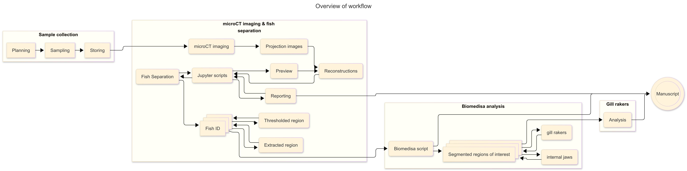
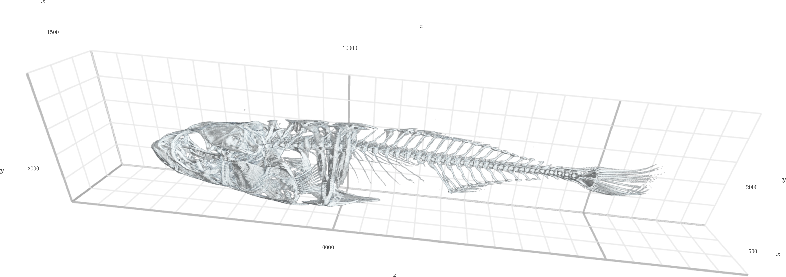

---
title: microCT imaging of threespine stickleback
keywords:
- tomography
- sticklebacks
- ecology
lang: en-US
date-meta: '2026-04-01'
author-meta:
- David Haberthür
- Ben Sulser
- Sheila Christen
- Catherine L. Peichel
- Ruslan Hlushchuk
header-includes: |
  <!--
  Manubot generated metadata rendered from header-includes-template.html.
  Suggest improvements at https://github.com/manubot/manubot/blob/main/manubot/process/header-includes-template.html
  -->
  <meta name="dc.format" content="text/html" />
  <meta property="og:type" content="article" />
  <meta name="dc.title" content="microCT imaging of threespine stickleback" />
  <meta name="citation_title" content="microCT imaging of threespine stickleback" />
  <meta property="og:title" content="microCT imaging of threespine stickleback" />
  <meta property="twitter:title" content="microCT imaging of threespine stickleback" />
  <meta name="dc.date" content="2026-04-01" />
  <meta name="citation_publication_date" content="2026-04-01" />
  <meta property="article:published_time" content="2026-04-01" />
  <meta name="dc.modified" content="2026-04-01T09:48:53+00:00" />
  <meta property="article:modified_time" content="2026-04-01T09:48:53+00:00" />
  <meta name="dc.language" content="en-US" />
  <meta name="citation_language" content="en-US" />
  <meta name="dc.relation.ispartof" content="Manubot" />
  <meta name="dc.publisher" content="Manubot" />
  <meta name="citation_journal_title" content="Manubot" />
  <meta name="citation_technical_report_institution" content="Manubot" />
  <meta name="citation_author" content="David Haberthür" />
  <meta name="citation_author_institution" content="microCT research group, Institute of Anatomy, University of Bern, Baltzerstrasse 2, 3012 Bern, Switzerland" />
  <meta name="citation_author_orcid" content="0000-0003-3388-9187" />
  <meta name="citation_author" content="Ben Sulser" />
  <meta name="citation_author_institution" content="Evolutionary Ecology Group, Institute of Ecology and Evolution, University of Bern, Baltzerstrasse 6, 3012 Bern, Switzerland" />
  <meta name="citation_author_orcid" content="0000-0002-8750-0942" />
  <meta name="citation_author" content="Sheila Christen" />
  <meta name="citation_author" content="Catherine L. Peichel" />
  <meta name="citation_author_institution" content="Division of Evolutionary Ecology, Institute of Ecology and Evolution, University of Bern, Baltzerstrasse 6, 3012 Bern, Switzerland" />
  <meta name="citation_author_orcid" content="0000-0002-7731-8944" />
  <meta name="citation_author" content="Ruslan Hlushchuk" />
  <meta name="citation_author_institution" content="microCT research group, Institute of Anatomy, University of Bern, Baltzerstrasse 2, 3012 Bern, Switzerland" />
  <meta name="citation_author_orcid" content="0000-0001-2345-6789" />
  <link rel="canonical" href="https://habi.github.io/sticklebacks-manuscript/" />
  <meta property="og:url" content="https://habi.github.io/sticklebacks-manuscript/" />
  <meta property="twitter:url" content="https://habi.github.io/sticklebacks-manuscript/" />
  <meta name="citation_fulltext_html_url" content="https://habi.github.io/sticklebacks-manuscript/" />
  <meta name="citation_pdf_url" content="https://habi.github.io/sticklebacks-manuscript/manuscript.pdf" />
  <link rel="alternate" type="application/pdf" href="https://habi.github.io/sticklebacks-manuscript/manuscript.pdf" />
  <link rel="alternate" type="text/html" href="https://habi.github.io/sticklebacks-manuscript/v/6a154d9b585986f943b22245def6513fddde23de/" />
  <meta name="manubot_html_url_versioned" content="https://habi.github.io/sticklebacks-manuscript/v/6a154d9b585986f943b22245def6513fddde23de/" />
  <meta name="manubot_pdf_url_versioned" content="https://habi.github.io/sticklebacks-manuscript/v/6a154d9b585986f943b22245def6513fddde23de/manuscript.pdf" />
  <meta property="og:type" content="article" />
  <meta property="twitter:card" content="summary_large_image" />
  <link rel="icon" type="image/png" sizes="192x192" href="https://manubot.org/favicon-192x192.png" />
  <link rel="mask-icon" href="https://manubot.org/safari-pinned-tab.svg" color="#ad1457" />
  <meta name="theme-color" content="#ad1457" />
  <!-- end Manubot generated metadata -->
bibliography:
- content/manual-references.bib
manubot-output-bibliography: output/references.json
manubot-output-citekeys: output/citations.tsv
manubot-requests-cache-path: ci/cache/requests-cache
manubot-clear-requests-cache: false
...

<small><em>
This manuscript
([permalink](https://habi.github.io/sticklebacks-manuscript/v/6a154d9b585986f943b22245def6513fddde23de/))
was automatically generated
from [habi/sticklebacks-manuscript@6a154d9](https://github.com/habi/sticklebacks-manuscript/tree/6a154d9b585986f943b22245def6513fddde23de)
on April 1, 2026.
</em></small>

## Authors

+ **David Haberthür**
   
    {.inline_icon width=16 height=16}
    [0000-0003-3388-9187](https://orcid.org/0000-0003-3388-9187)
    · {.inline_icon width=16 height=16}
    [habi](https://github.com/habi)
    · {.inline_icon width=16 height=16}
    [\@habi@mastodon.social](https://mastodon.social/@habi)
     
  <small>
     microCT research group, Institute of Anatomy, University of Bern, Baltzerstrasse 2, 3012 Bern, Switzerland
  </small>

+ **Ben Sulser**
   
    {.inline_icon width=16 height=16}
    [0000-0002-8750-0942](https://orcid.org/0000-0002-8750-0942)
    · {.inline_icon width=16 height=16}
    [sulserrb](https://github.com/sulserrb)
     
  <small>
     Evolutionary Ecology Group, Institute of Ecology and Evolution, University of Bern, Baltzerstrasse 6, 3012 Bern, Switzerland
     · Funded by Bern Burgergemeinde
  </small>

+ **Sheila Christen**
   
  <small>
  </small>

+ **Catherine L. Peichel**
   
    {.inline_icon width=16 height=16}
    [0000-0002-7731-8944](https://orcid.org/0000-0002-7731-8944)
    · {.inline_icon width=16 height=16}
    [cpeichel](https://github.com/cpeichel)
     
  <small>
     Division of Evolutionary Ecology, Institute of Ecology and Evolution, University of Bern, Baltzerstrasse 6, 3012 Bern, Switzerland
     · Funded by Swiss National Science Foundation (TMAG-3_209309/1)
  </small>

+ **Ruslan Hlushchuk**
  ^[✉](#correspondence)^ 
    {.inline_icon width=16 height=16}
    [0000-0001-2345-6789](https://orcid.org/0000-0001-2345-6789)
    · {.inline_icon width=16 height=16}
    [RuslanHlushchuk](https://github.com/RuslanHlushchuk)
     
  <small>
     microCT research group, Institute of Anatomy, University of Bern, Baltzerstrasse 2, 3012 Bern, Switzerland
  </small>

::: {#correspondence}
✉ — Correspondence possible via [GitHub Issues](https://github.com/habi/sticklebacks-manuscript/issues)
or email to
Ruslan Hlushchuk \<ruslan.hlushchuk@unibe.ch\>.

:::

## Abstract {.page_break_before}

Can we predict evolution?

The three-spined stickleback (Gasterosteus aculeatus) is a well-recognized system for understanding adaptation to divergent habitats.
Populations of benthic and limnetic stickleback differ in a number of phenotypic traits that are associated with shifts in dietary specialization.
However, analyses of the structures required for feeding – especially the jaws and complex internal branchial anatomy – requires considerable time and expertise, with destructive sampling and fine dissection skills needed for quantitative analysis.

The advent of µCT and 3D-scanning technology affords non-destructive sampling and an increase the resolution of data available for study, but at the substantial cost of increasing complexity and processing time for each specimen.

To address these concerns, we developed a rapid and semi-automated segmentation and analysis pipeline based on both the Jupyter interactive development environment and the Biomedisa image segmentation platform for investigating three-dimensional morphological adaptation within the three-spined stickleback.

The pipeline includes splitting 44 multi-specimen scans into regions of interest for each specimen, reconstruction of targeted anatomy, and morphometric analyses.
We then applied this pipeline to a sampling effort encompassing hundreds of samples of divergent benthic and limnetic stickleback populations (N=216), showcasing the possibility of using high-throughput scanning data to provide tests of ecological and evolutionary hypotheses.

## Introduction {.page_break_before}

 The threespine stickleback (Gasterosteus aculeatus) is an oft-studied organism for understanding the independent evolution of similar traits in similar environments.
 This species exhibits marked differences in marine-freshwater, lake-stream, and benthic-limnetic ecotypes4.
 This study will focus on the benthic-limnetic axis, using samples from a long-term evolutionary experiment currently in-process studying divergent populations of limnetic and benthic stickleback within the Kenai peninsula of Alaska (USA).
 This project, the Forward In Time Natural Experimental Study of Selection (FITNESS), aims to study the predictability and repeated of evolution.
 Two pools of sticklebacks — one made from four source populations of limnetic and four source populations of benthic sticklebacks — have been placed into eight destination lakes, four of which are small and benthic and four of which are large and limnetic.
 These new populations have been sampled every year in order to track the genotypic and phenotypic trajectories of these introduced populations.
 Understanding the initial variation in the source populations is essential to this endeavor, as this initial variation would be expected to reflect which phenotypes are associated with each ecotype under study.
 Among these and other bony fish, the internal hyoid arch-branchial arch complex is an important structure implicated in diet and feeding ecology.
 The pharyngobranchial bones at the posterior margin of this complex (and their corresponding ceratobranchials) aid in dietary processing.
 The "gill rakers" on the ceratobranchials and the "internal jaws" of the are strong indicators of different foraging styles, and have been shown to be related to genotypic and phenotypic changes in different species, and even among different populations.
 These structures are, however, difficult to study without full cranial dissection and distortion of the branchial anatomy.

- Embedded into [Alaska Stickleback Restoration Project](https://alaskastickleback.com/), [Genomics axis](https://alaskastickleback.com/genomics) where Katie Peichel, Ben Sulser and Sheila Christen are affiliated.
- Why are we studying what we are studying in these fish?

## Micro-computed tomography

X-ray microtomography is an indispensable tool to gain non-destructive insights into the inner structure of highly diverse samples, namely for specimens studied in the biomedical sciences [@doi:10.1186/s12915-020-0753-2].
Microtomographic imaging is ideally suited to non-destructively assess the morphology of different fish species, large and small [@doi:10.1093/iob/obad008], including the internal anatomy.
While these structures can be rendered by-hand by a skilled investigator, the time and cost required per-specimen is inefficient for the scale required via eco-evolutionary study.
This project aims to address these gaps, demonstrating a novel pipeline for rendering and auto-splitting of a multispecimen scan for mass sampling, creating a dataset with consistent parameters that can be fed to donwstream machine-learning techniques [Biomedisa] to aid in the segmentation of individual bony structures in each scan.
Once a Biomedisa model is trained, the entire pipeline runs from multi-specimen input to rendered structures for each specimen in a fraction of the time and resources used in traditional analysis.

<!---
Do we have to give a bit of background on uCT imaging, e.g. write about resolution, staining, etc? 

---I don't think so? Some of this can be offloaded in to materials and methods, I think
--->

## Materials & Methods {.page_break_before}

{#fig:workflow}

### Sample procurement and preparation

The specimens used for this study were collected from source lakes as a part of the FITNESS project in the region of Cook Inlet, Alaska.
Fish were collected using unbaited minnow traps in two separate field seasons, the first taking place from May 26 - June 10 2023 and the second taking place from May 25 - June 11 2024.
Specimen collections were taken from a random sample of 30 fish from each lake.
Fish were euthanized with MS-222, photographed, and preserved in formalin in a bag with a specific label.
At the end of each field season, samples were shipped from Anchorage (AK, USA) to Bern (BE, CH) where they were stored until scanning time.

<!-- How were they kept/stored? 75% Ethanol?-->
<!-- Add the permits and numbers once we get them! -->

Due to their inherent contrast difference to the surrounding tissue, the structures of interest we touch upon in this manuscript (teeth and bones, i.e. jaws and skull) are well visualized in unstained samples, hence no further preparation of the fish was necessary.

### microtomographic imaging

In a small pilot study we determined the optimal scanning parameters to fit the constraints on total scanning time, resolution and sample handling.
To optimize for these constraints, we scanned all the sticklebacks in batches of six fish in a custom-made 3D printed sample holder in a single scan.
This holder was generated with [OpenSCAD](https://openscad.org/) and is available online, either directly as [STL file for printing](https://github.com/TomoGraphics/Hol3Drs/blob/master/STL/Stickleback.Multiple.stl) or as [(parameterized) OpenSCAD file](https://github.com/TomoGraphics/Hol3Drs/blob/master/Stickleback.Multiple.scad) for adaptation to other classes of samples.
Both files are part of a library of 3D-printable sample holders for tomographic imaging [@doi:10.5281/zenodo.2587555].

Tomographic imaging was performed on a [Bruker SkyScan 2214](https://www.bruker.com/en/products-and-solutions/diffractometers-and-x-ray-microscopes/3d-x-ray-microscopes/skyscan-2214.html) at the Institute of Anatomy, University of Bern, Switzerland.
In total we performed 44 scans, each of the scan usually containing 6 fish in the sample holder.

The relevant details of each scan are collated in a table in the [Supplementary Materials]; a short overview of the scanning parameters is given below.
The X-ray source was set to a voltage of 60 kV and a current of around 110 µA for all but one scan where we used a source voltage of 49 kV and 159 µA due to operator error.
For each sample, we recorded a set of 3601 projections of approximately 3000 x 2000 pixels at every 0.1° over a 360° sample rotation.
Every single projection was exposed for about a second (depending on the sample).
Due to the length of the fish, we had to acquire so-called stacked scans, on average we scanned 3 fields of view along the rotation axis of the sample holder.
This resulted in scan times between 3 to 5 hours.
The projection images were then subsequently reconstructed into a 3D stack of images with NRecon (Bruker microCT, Kontich Belgium, Version: 2.1.0.1 or 2.2.0.6).
The isometric voxel sized in the resulting datasets vary from 15 to 19 µm.

### Data analysis

#### Preparation and handling of tomographic datasets

After acquisition, [a simple script](https://github.com/habi/sticklebacks/blob/main/rsync-sticklebacks.sh) was used to copy the relevant data to both archival storage and storage accessible by all co-authors at the same time.

Further processing of the tomographic dataset was performed with a set of Jupyter [@doi:10.3233/978-1-61499-649-1-87] [notebooks](https://github.com/habi/sticklebacks) [@doi:10.5281/zenodo.18257528].
The scripts are freely available online under the MIT License and may be freely used, modified, and redistributed for research, teaching, and other non-military purposes.

##### Preview notebook

The [preview notebook](https://nbviewer.org/github/habi/sticklebacks/blob/main/PreviewScans.ipynb) is used for surfacing issues with the scanning.
For this, we read all relevant scanning and reconstruction parameters from the log files of each scan.
Afterwards, we efficiently loading the reconstruction PNG images from disk with the [`dask_image.imread.imread`](https://image.dask.org/en/latest/dask_image.imread.html) function [@dask].
Like so, we can map all the generated reconstructions to memory and quickly generate maximum intensity projections (MIP) of each scan (see Figure @fig:mips for an example) for both quality control and further processing.

{#fig:mips}

##### Separation notebook

The [separation notebook](https://nbviewer.org/github/habi/sticklebacks/blob/main/BucketSeparator.ipynb) processes all the performed scans to extract the single fish out from each scan, where 6 fish have been scanned.
As in the preview notebook, we efficiently load all the PNGs from disk with [`dask`](https://www.dask.org/) [@dask].
Based on the previously extracted MIP images and a simple labeling of these images (`skimage.measure.label`), we extract both the labels in the custom-made sample holder and the positions of single fish in the scan (`skimage.measure.regionprops`) (see Figure @fig:labels).
This extraction is completely reproducible and well-adapted to the custom-made sample holder.

{#fig:labels}

Based on a simple mapping of the detected region to the ID numbers of the scanned fish, we labeled the resulting images and presented these images together with photos of the lab book and sample tubes for double-checking (see Figure @fig:checking).

{#fig:checking}

The `skimage.measure.regionprops` function we used for labeling returns not only the positions of the detected fish, but also the extent of the bounding box of the region of the fish shown in the original image.
We extracted each region of each fish separately out of the large reconstructions (with a configurable border buffer, see Figure @fig:cropping) and wrote these extracted regions to disk in discrete folders for efficient further analysis.
In a first step, we wrote the regions of the single fish to disk in `zarr` [@doi:10.5281/zenodo.3773450] format, which is a preferred format to store n-dimensional arrays on disk.
In addition to this, we also wrote a log file for each extracted region, containing all relevant information to redo the cropping step completely manually (an [example of such a log file](https://github.com/habi/sticklebacks/blob/main/logfiles/BucketOfFish_H/rec_regions/SL.X23.016/SL.X23.016.log) is shown as part of the processing repository).

{#fig:cropping}

Saving out the regions as `zarr` files made it possible to efficiently work with the image data of each extracted fish and to convert that data to any desired format for further analysis.
For this further analysis, we wrote out stacks of PNG images and additionally, as [`nrrd`](https://teem.sourceforge.net/nrrd/) files for each fish region as a simple crop out of the original dataset and as binarized regions, which are segmented into bone and background based on a simple multi-level Otsu thresholding method [@doi:10.6688/JISE.2001.17.5.1].

Using `K3D-jupyter` [@url:https://k3d-jupyter.org] we implemented a quick way to view any of the extracted regions directly in the Jupyter notebook (see Figure @fig:k3d).
An [interactive version of this figure](https://htmlpreview.github.io/?https://raw.githubusercontent.com/habi/sticklebacks-manuscript/refs/heads/main/content/data/SL.X23.012.3D.html) is available online.

{#fig:k3d}

#### Extraction of features of interest

- Biomedisa [@doi:10.1038/s41467-020-19303-w]

## Results {.page_break_before}

### microCT data

<!-- Should the microCT "result" (numbers, etc.) be shown/noted in the Materials&Methods section instead of here? -->

- We actually scanned N=216 fishes (unique Fish IDs)
- The total scanning duration was 18 days, 12 hours and 6 minutes
- In total, we acquired 158444 projections
- These were reconstructed into a total of 177749 reconstructions
  Which is about 4040 files per scan (N=44)
- ~44 GB of `.zarr` files, ~64 GB of `.nrrd` files

### Fish separation

Our method reproducibly extracts each of the 6 fish scanned simultaneously in one scan.
The custom-made sample holder aligns the single fish in the vertical axis around the rotation axis of the tomographic scan.
The extraction based on the MIP image along the rotation axis is completely automated and very robust, since the detected fish 'regions' do not overlap in the resulting image.

Depending on the available machine it would even not be possible to load the full stack of each scan into a software to manually perform the cropping, such as Fiji [@doi:10.1038/nmeth.2019].
Large stacks of images (in other words larger than the RAM of the available machine) can be loaded as 'virtual stacks', but o manually crop the region of each fish from the large scan with the [Crop (3D)](https://www.longair.net/edinburgh/imagej/three-pane-crop/) function, one needs to load the full dataset.
Since one (excemplary dataset (Sticklebucket_10)) is 7 GB on disk and reported as being 35.4 GB when loaded in Fiji, using the 3D cropping function on an uncropped single dataset is not possible without using a powerful workstation.

Extracting the single fish from the encompassing dataset would thus be a two-step manual process, e.g. croppin the full dataset loaded as '[virtual stack](https://imagej.net/ij/docs/guide/146-8.html#sub:Virtual-Stacks)' and then cropping it down further before writing out the cropped stack.
For each encompassing scan this would need to be repeated 6 times (for *each* of the six fish in each of the encompassing scans).
In addition, such a manual process is not reproducible in the sense that it cannot be consistently replicated by others using the same data since the manual cropping is operator-dependent.
Algorithmically/automaticaly cropping the large datasets based on the axial MIP image leads to both reproducible cropped regions and efficiently uses the operator time (namely *no* operator time).

Our automated extraction process also writes human-readable log files documenting the cropping position in the encompassing dataset and the crop extent.
This enables reproducible double-checking and confirmation of the process after the fact (see this [direct link for one such log file](https://github.com/habi/sticklebacks/blob/main/logfiles/Sticklebucket_10/rec_regions/FG.X24.027/FG.X24.027.log)).

### Analysis

- 3D shape variation on internal pharyngobranchial bone.
  Only possible to get this information in 3D.

## Discussion {.page_break_before}

- Both *repeatable* and *reproducible* research
- Automated cropping out of single fish from combined scan very efficiently uses machine time.
  Several fish can be scanned together, splitting is performed after the fact, reproducibly and without manual input.
- Combination of methods cuts down on time **a lot**.
- Biomedisa makes more "extraction" possible.
  Other biological questions can be answered, too.

## Conclusion {.page_break_before}

## Author Contributions {.page_break_before}

[Contributor Roles Taxonomy (CRediT)](https://credit.niso.org/), as defined in [@doi:10.3789/ansi.niso.z39.104-2022]:

- [Conceptualization](https://credit.niso.org/contributor-roles/conceptualization/): Ben Sulser, Ruslan Hlushchuk
- [Data curation](https://credit.niso.org/contributor-roles/data-curation/): David Haberthür, Ben Sulser
- [Formal analysis](https://credit.niso.org/contributor-roles/formal-analysis/): David Haberthür, Ben Sulser
- [Funding acquisition](https://credit.niso.org/contributor-roles/funding-acquisition/): Ben Sulser, Catherine L. Peichel, Ruslan Hlushchuk
- [Investigation](https://credit.niso.org/contributor-roles/investigation/): David Haberthür, Ben Sulser
- [Methodology](https://credit.niso.org/contributor-roles/methodology/): David Haberthür, Ben Sulser, Ruslan Hlushchuk
- [Project administration](https://credit.niso.org/contributor-roles/project-administration/): David Haberthür, Ben Sulser, Catherine L. Peichel, Ruslan Hlushchuk
- [Resources](https://credit.niso.org/contributor-roles/resources/): Ben Sulser, Ruslan Hlushchuk
- [Software](https://credit.niso.org/contributor-roles/software/): David Haberthür, Ben Sulser
- [Supervision](https://credit.niso.org/contributor-roles/supervision/): Ben Sulser, Catherine L. Peichel, Ruslan Hlushchuk
- [Validation](https://credit.niso.org/contributor-roles/validation/): David Haberthür, Ben Sulser
- [Visualization](https://credit.niso.org/contributor-roles/visualization/): David Haberthür, Ben Sulser
- [Writing – original draft](https://credit.niso.org/contributor-roles/writing---original-draft/): David Haberthür, Ben Sulser
- [Writing – review & editing](https://credit.niso.org/contributor-roles/writing---review-&-editing/): David Haberthür, Ben Sulser, Catherine L. Peichel, Ruslan Hlushchuk

## Competing Interest

|Author|Competing Interests|Last Reviewed|
|---|---|---|
|David Haberthür|None|2026-01-14|
|Ben Sulser|Nothing to Declare||
|Sheila Christen|||
|Catherine L. Peichel|none|2026-01-19|
|Ruslan Hlushchuk|None|2026-01-19|

## Acknowledgments

We are grateful to the [Microscopy Imaging Center](https://mic.unibe.ch/) of the University of Bern for their infrastructural support.
We also thank the `manubot` project [@doi:10.1371/journal.pcbi.1007128] for facilitating collaborative writing of this manuscript.

## Supplementary Materials

### Parameters of tomographic scans of all the fishes

The CSV file [ScanningDetails.csv](https://github.com/habi/stickleback-manuscript/blob/main/content/data/ScanningDetails.csv) gives a tabular overview of all the (relevant) parameters of all the scans we performed.
This file was generated with the [data processing notebook](https://github.com/habi/sticklebacks/blob/main/DataWrangling.ipynb) and collates the relevant data read from *all* the log files of *all* the scans we performed.
A copy of each log file containing *all* scanning parameters is available in a [folder in the data processing repository](https://github.com/habi/sticklebacks/tree/main/logfiles).

## References {.page_break_before}

<!-- Explicitly insert bibliography here -->

