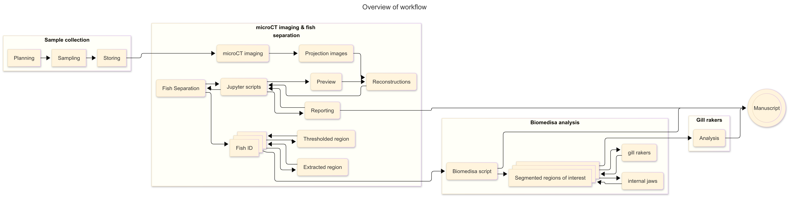
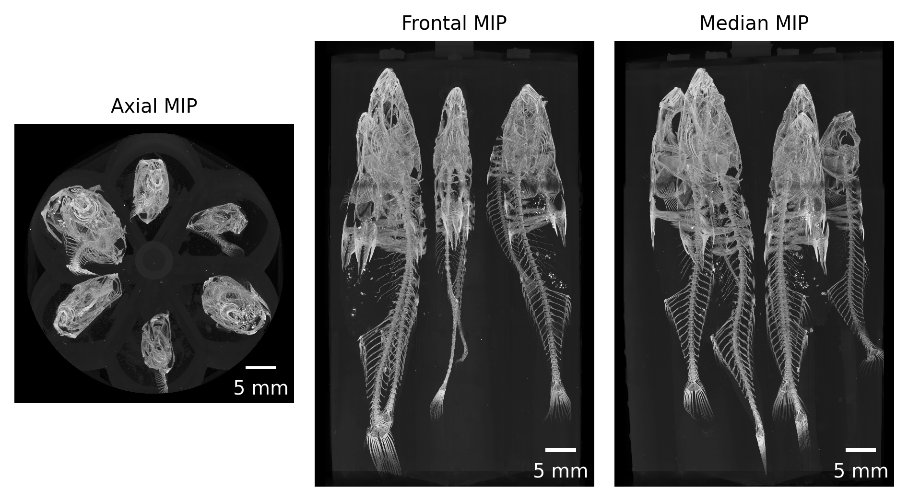
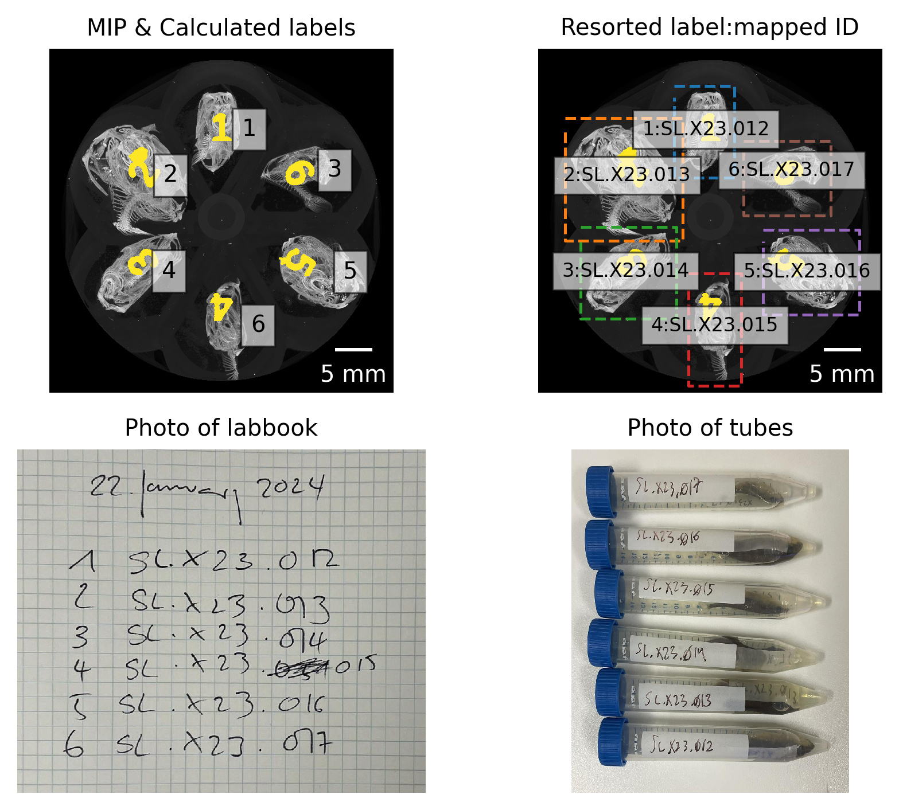
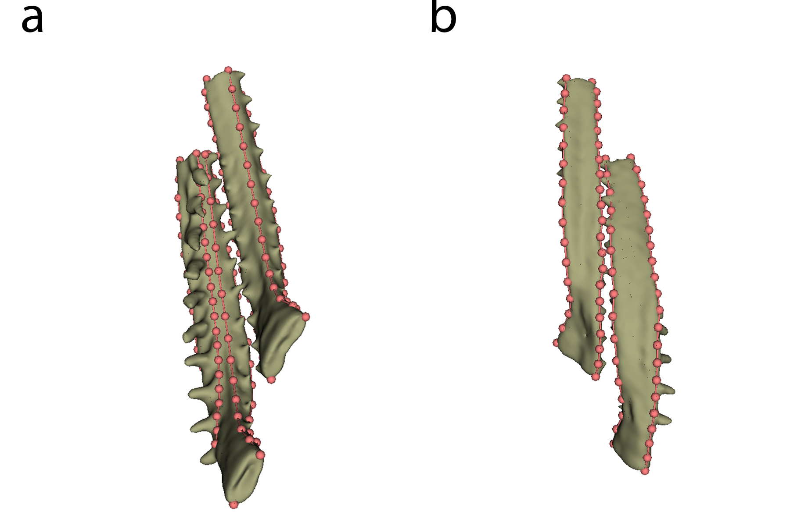

---
title: 'High-Throughput Micro-CT and Automated Segmentation for Eco-Evolutionary Studies: A Case Study from Threespine Stickleback'
keywords:
- tomography
- high-throughput
- stickleback
- ecology
lang: en-US
date-meta: '2026-08-27'
author-meta:
- David Haberthür
- R. Benjamin Sulser
- Sheila Christen
- Catherine L. Peichel
- Ruslan Hlushchuk
header-includes: |
  <!--
  Manubot generated metadata rendered from header-includes-template.html.
  Suggest improvements at https://github.com/manubot/manubot/blob/main/manubot/process/header-includes-template.html
  -->
  <meta name="dc.format" content="text/html" />
  <meta property="og:type" content="article" />
  <meta name="dc.title" content="High-Throughput Micro-CT and Automated Segmentation for Eco-Evolutionary Studies: A Case Study from Threespine Stickleback" />
  <meta name="citation_title" content="High-Throughput Micro-CT and Automated Segmentation for Eco-Evolutionary Studies: A Case Study from Threespine Stickleback" />
  <meta property="og:title" content="High-Throughput Micro-CT and Automated Segmentation for Eco-Evolutionary Studies: A Case Study from Threespine Stickleback" />
  <meta property="twitter:title" content="High-Throughput Micro-CT and Automated Segmentation for Eco-Evolutionary Studies: A Case Study from Threespine Stickleback" />
  <meta name="dc.date" content="2026-08-27" />
  <meta name="citation_publication_date" content="2026-08-27" />
  <meta property="article:published_time" content="2026-08-27" />
  <meta name="dc.modified" content="2026-08-27T07:37:04+00:00" />
  <meta property="article:modified_time" content="2026-08-27T07:37:04+00:00" />
  <meta name="dc.language" content="en-US" />
  <meta name="citation_language" content="en-US" />
  <meta name="dc.relation.ispartof" content="Manubot" />
  <meta name="dc.publisher" content="Manubot" />
  <meta name="citation_journal_title" content="Manubot" />
  <meta name="citation_technical_report_institution" content="Manubot" />
  <meta name="citation_author" content="David Haberthür" />
  <meta name="citation_author_institution" content="microCT research group, Institute of Anatomy, University of Bern, Baltzerstrasse 2, 3012 Bern, Switzerland" />
  <meta name="citation_author_orcid" content="0000-0003-3388-9187" />
  <meta name="citation_author" content="R. Benjamin Sulser" />
  <meta name="citation_author_institution" content="Division of Evolutionary Ecology, Institute of Ecology and Evolution, University of Bern, Baltzerstrasse 6, 3012 Bern, Switzerland" />
  <meta name="citation_author_orcid" content="0000-0002-8750-0942" />
  <meta name="citation_author" content="Sheila Christen" />
  <meta name="citation_author_institution" content="Division of Evolutionary Ecology, Institute of Ecology and Evolution, University of Bern, Baltzerstrasse 6, 3012 Bern, Switzerland" />
  <meta name="citation_author_orcid" content="0009-0008-3514-0800" />
  <meta name="citation_author" content="Catherine L. Peichel" />
  <meta name="citation_author_institution" content="Division of Evolutionary Ecology, Institute of Ecology and Evolution, University of Bern, Baltzerstrasse 6, 3012 Bern, Switzerland" />
  <meta name="citation_author_orcid" content="0000-0002-7731-8944" />
  <meta name="citation_author" content="Ruslan Hlushchuk" />
  <meta name="citation_author_institution" content="microCT research group, Institute of Anatomy, University of Bern, Baltzerstrasse 2, 3012 Bern, Switzerland" />
  <meta name="citation_author_orcid" content="0000-0002-6722-8996" />
  <link rel="canonical" href="https://habi.github.io/sticklebacks-manuscript/" />
  <meta property="og:url" content="https://habi.github.io/sticklebacks-manuscript/" />
  <meta property="twitter:url" content="https://habi.github.io/sticklebacks-manuscript/" />
  <meta name="citation_fulltext_html_url" content="https://habi.github.io/sticklebacks-manuscript/" />
  <meta name="citation_pdf_url" content="https://habi.github.io/sticklebacks-manuscript/manuscript.pdf" />
  <link rel="alternate" type="application/pdf" href="https://habi.github.io/sticklebacks-manuscript/manuscript.pdf" />
  <link rel="alternate" type="text/html" href="https://habi.github.io/sticklebacks-manuscript/v/1a28955dd506b2c64de6e80fcb4c44728d8096d1/" />
  <meta name="manubot_html_url_versioned" content="https://habi.github.io/sticklebacks-manuscript/v/1a28955dd506b2c64de6e80fcb4c44728d8096d1/" />
  <meta name="manubot_pdf_url_versioned" content="https://habi.github.io/sticklebacks-manuscript/v/1a28955dd506b2c64de6e80fcb4c44728d8096d1/manuscript.pdf" />
  <meta property="og:type" content="article" />
  <meta property="twitter:card" content="summary_large_image" />
  <link rel="icon" type="image/png" sizes="192x192" href="https://manubot.org/favicon-192x192.png" />
  <link rel="mask-icon" href="https://manubot.org/safari-pinned-tab.svg" color="#ad1457" />
  <meta name="theme-color" content="#ad1457" />
  <!-- end Manubot generated metadata -->
bibliography:
- content/manual-references.bib
manubot-output-bibliography: output/references.json
manubot-output-citekeys: output/citations.tsv
manubot-requests-cache-path: ci/cache/requests-cache
manubot-clear-requests-cache: false
...

*The (anonymized) version [`v1.0`](https://github.com/habi/sticklebacks-manuscript/releases/tag/v1.0) of this manuscript was submitted to [Methods in Ecology and Evolution](https://besjournals.onlinelibrary.wiley.com/journal/2041210X).*

<small><em>
This manuscript
([permalink](https://habi.github.io/sticklebacks-manuscript/v/1a28955dd506b2c64de6e80fcb4c44728d8096d1/))
was generated
from [habi/sticklebacks-manuscript@1a28955](https://github.com/habi/sticklebacks-manuscript/tree/1a28955dd506b2c64de6e80fcb4c44728d8096d1)
on August 27, 2026 and contains 5393 words.
Changes to the submitted version are visualized [here on GitHub](https://github.com/habi/sticklebacks-manuscript/compare/v1.0...1a28955dd506b2c64de6e80fcb4c44728d8096d1#files_bucket).
</em></small>

## Authors

+ **David Haberthür**
   
    {.inline_icon width=16 height=16}
    [0000-0003-3388-9187](https://orcid.org/0000-0003-3388-9187)
    · {.inline_icon width=16 height=16}
    [habi](https://github.com/habi)
    · {.inline_icon width=16 height=16}
    [\@habi@mastodon.social](https://mastodon.social/@habi)
     
  <small>
     microCT research group, Institute of Anatomy, University of Bern, Baltzerstrasse 2, 3012 Bern, Switzerland
  </small>

+ **R. Benjamin Sulser**
   
    {.inline_icon width=16 height=16}
    [0000-0002-8750-0942](https://orcid.org/0000-0002-8750-0942)
    · {.inline_icon width=16 height=16}
    [sulserrb](https://github.com/sulserrb)
     
  <small>
     Division of Evolutionary Ecology, Institute of Ecology and Evolution, University of Bern, Baltzerstrasse 6, 3012 Bern, Switzerland
     · Funded by Burgergemeinde Bern
  </small>

+ **Sheila Christen**
   
    {.inline_icon width=16 height=16}
    [0009-0008-3514-0800](https://orcid.org/0009-0008-3514-0800)
    · {.inline_icon width=16 height=16}
    [SheilaChristen](https://github.com/SheilaChristen)
     
  <small>
     Division of Evolutionary Ecology, Institute of Ecology and Evolution, University of Bern, Baltzerstrasse 6, 3012 Bern, Switzerland
     · Funded by Burgergemeinde Bern
  </small>

+ **Catherine L. Peichel**
   
    {.inline_icon width=16 height=16}
    [0000-0002-7731-8944](https://orcid.org/0000-0002-7731-8944)
    · {.inline_icon width=16 height=16}
    [cpeichel](https://github.com/cpeichel)
     
  <small>
     Division of Evolutionary Ecology, Institute of Ecology and Evolution, University of Bern, Baltzerstrasse 6, 3012 Bern, Switzerland
     · Funded by Swiss National Science Foundation (TMAG-3_209309/1)
  </small>

+ **Ruslan Hlushchuk**
  ^[✉](#correspondence)^ 
    {.inline_icon width=16 height=16}
    [0000-0002-6722-8996](https://orcid.org/0000-0002-6722-8996)
    · {.inline_icon width=16 height=16}
    [RuslanHlushchuk](https://github.com/RuslanHlushchuk)
     
  <small>
     microCT research group, Institute of Anatomy, University of Bern, Baltzerstrasse 2, 3012 Bern, Switzerland
  </small>

::: {#correspondence}
✉: Correspondence via [GitHub Issues](https://github.com/habi/sticklebacks-manuscript/issues)
or email to
[Ruslan Hlushchuk](mailto:ruslan.hlushchuk@unibe.ch?subject=Feedback%20on%20%22High-Throughput Micro-CT and Automated Segmentation for Eco-Evolutionary Studies: A Case Study from Threespine Stickleback%22).

:::

## Abstract {.page_break_before}

The threespine stickleback is a well-recognized model system for understanding adaptation to divergent habitats.
The populations of benthic stickleback (benthos-feeding) and limnetic stickleback (water-column-feeding) differ in the phenotypic traits associated with dietary specialization.
Modern investigations of evolutionary change in this organism often require the analysis of hundreds, if not thousands, of individuals.
However, analysis of feeding structures---particularly jaws and complex internal branchial anatomy---remains time-consuming and requires considerable expertise, with destructive sampling and fine dissection skills needed for quantitative analysis.

The advent of X-ray microtomography and three-dimensional scanning technologies enables nondestructive imaging and greatly increases the availability of high-resolution morphological data.
However, the resulting increase in data complexity and processing demands often makes these approaches impractical for large-scale studies, especially at population scales that often require measuring and analyzing hundreds to thousands of samples.

To address these challenges, we developed a rapid and semi-automated segmentation and analysis pipeline based on the Jupyter interactive development environment and the Biomedisa image segmentation platform to investigate three-dimensional morphological adaptation in the threespine stickleback (*Gasterosteus aculeatus*).

The pipeline includes separation of multi-specimen scans into individual regions of interest, reconstruction of targeted anatomical structures, and morphometric analyses.
We applied this pipeline to 38 multi-specimen scans comprising 215 specimens from divergent benthic and limnetic stickleback populations, demonstrating the potential of a high-throughput micro-CT imaging approach for testing ecological and evolutionary hypotheses.
These replicable, clade-agnostic methods provide a scalable pipeline that researchers working across diverse systems can adapt for high-throughput micro-CT sampling at scale.

## Introduction {.page_break_before}

The threespine stickleback (*Gasterosteus aculeatus*) is a well-established model system for understanding the independent evolution of similar traits in similar environments [@doi:10.1093/oso/9780198577287.001.0001; @doi:10.1146/annurev-genom-111720-081402].
This species exhibits marked differences in marine--freshwater, lake--stream, and benthic--limnetic ecotypes [@doi:10.1086/285404; @doi:10.1111/j.1095-8649.2009.02419.x].
This study focused on the benthic-limnetic axis, which resolves distinct stickleback ecotypes based primarily on dietary ecology (benthic stickleback forage on macroinvertebrates at the bottom of lakes; limnetic stickleback forage on zooplankton within the water column [@doi:10.1111/j.1095-8312.2010.01531.x]).
The samples for this study were collected from the benthic and limnetic source populations used to establish a long-term evolutionary experiment within the Kenai Peninsula of Alaska (USA) [@doi:10.1002/ece3.11503].
This project, the Forward In Time Natural Experimental Study of Selection (FITNESS), aims to study the predictability and repeatability of evolution.
Two pools of sticklebacks, one comprising four source populations of limnetic sticklebacks and the other comprising four source populations of benthic sticklebacks, have been placed in eight destination lakes, four of which are small and benthic and four of which are large and limnetic.
These new populations have been sampled every year to track the genotypic and phenotypic trajectories of these introduced populations.
Understanding the initial variation in the source populations is essential for this project, as it provides the raw material for the evolution in the destination lakes.

Among sticklebacks and other bony fish, differences in jaw structures are directly related to functional and kinematic differences between different ecotypes [@doi:10.1002/ece3.6929].
Benthic sticklebacks have modified jaws for enhanced suction force and hypertrophied epaxial muscles to aid in foraging on benthic invertebrates, while limnetic sticklebacks have modifications for larger jaw protrusions and quick strikes during ram feeding [@doi:10.1186/1471-2148-13-277].
The internal hyoid arch-branchial arch complex is an important structure involved in diet and feeding ecology [@doi:10.1086/285404; @doi:10.1111/j.1420-9101.2008.01583.x].
Although the shape and arrangement of the paired ceratobranchial and pharyngobranchial bones within this complex aid in food processing and water vortex generation during feeding [@doi:10.1371/journal.pone.0193874], the shape of these bones has received relatively little attention in relation to other aspects of dietary anatomy.
This is likely due to the flattening and destructive sampling used in traditional raker counting methods, which dissect and deform these structures to make them visible for manual measurements [@doi:10.3791/54056].
However, these structures are difficult to study without full cranial dissection and the corresponding distortion of the branchial anatomy.
X-ray microtomography-based three-dimensional (3D) imaging preserves these features at a high resolution and allows for nondestructive analysis.
However, imaging large numbers of stickleback specimens has until now been prohibitive due to the limitations of acquisition and processing time.

## X-Ray Microtomography

High-resolution X-ray tomography (micro-CT) imaging is an indispensable tool to gain nondestructive insights into the inner structure of highly diverse samples, specifically for specimens in biomedical research [@doi:10.1186/s12915-020-0753-2].
Micro-CT imaging is ideally suited for nondestructive anatomical assessments in fish [@doi:10.1093/iob/obad008], capturing internal structures and delicate skeletal elements that are otherwise difficult to quantify without destructive preparation.

Although these small structures can be manually rendered by a skilled investigator using segmentation tools such as 3D Slicer [@doi:10.1007/978-1-4614-7657-3_19; @doi:10.1111/2041-210X.13669], the time and resources required per sample make this approach infeasible for population-level and evolutionary studies.
Furthermore, accessing these structures typically requires destruction of the mandibular and cranial anatomy, preventing subsequent analyses of these features.

This project aims to address these gaps, demonstrating a novel pipeline for automatic splitting and rendering of multi-specimen scans for mass sampling, creating a dataset with consistent parameters that can be used as input for downstream machine learning approaches [@doi:10.1038/s41467-020-19303-w] to aid in the segmentation of individual bony structures in each scan.
Once a Biomedisa model is trained, the entire pipeline runs from multi-specimen input to reconstructed anatomical structures for each specimen in a fraction of the time and resources required for traditional analysis.

## Materials & Methods {.page_break_before}

{#fig:workflow}

### Sample Procurement and Preparation

The samples used for this study were collected from six of the eight source lakes used for the FITNESS project in the region of Cook Inlet, Alaska.
Fish were collected using unbaited minnow traps in two separate field seasons, the first from May 26--June 10, 2023 and the second from May 25--June 11, 2024.
Specimens were collected from a random sample of up to 30 fish from each lake, under Alaska Department of Fish and Game (ADFG) permits SF2023-030 and P-24-015 for 2023 and 2024, respectively.
The fish were sacrificed with MS-222, photographed, labeled and preserved in 10% formalin in individual bags, all under McGill University Animal Use Protocol (AUP) MCGL-8265.
At the end of each field season, samples were shipped from Anchorage (AK, USA) to Bern (BE, CH), where they were stored until scanning.
The total number of fish for each lake was: 52 from Watson Lake (benthic), 48 from Finger Lake (benthic), 46 from Spirit Lake (limnetic), 35 from South Rolly Lake (limnetic), 20 from Walby Lake (benthic), and 14 from Tern Lake (benthic) for a total of 215 specimens.
Additionally, caudal fin clips were collected from fish sampled during the 2024 field season for molecular sex identification through genotyping.
DNA was extracted from fin tissue following Meeker et al. [@doi:10.2144/000112619], and subsequent PCR genotyping with LRRc61 primers was performed, following Archambeault et al. [@doi:10.1002/evl3.175].

Due to their inherent contrast difference with the surrounding tissue, the structures of interest in this study (teeth and bones, i.e., jaws and skull) are well visualized in unstained samples, so no further preparation of the fish was necessary.

### Micro-CT Imaging

In a pilot study, we identified optimal scanning parameters to meet the constraints on total scanning time, resolution, and sample handling.
To optimize for these constraints, we scanned all sticklebacks in batches of six fish in a custom-made 3D-printed sample holder in a single scan.
This holder was designed in [OpenSCAD](https://openscad.org/) (OpenSCAD Developers. Version 2021.01) and is available online, either directly as [STL file for printing](https://github.com/TomoGraphics/Hol3Drs/blob/master/STL/Stickleback.Multiple.stl) or as [(parameterized) OpenSCAD file](https://github.com/TomoGraphics/Hol3Drs/blob/master/Stickleback.Multiple.scad) for adaptation to other classes of samples.
Both files are part of a library of 3D-printable sample holders for tomographic imaging [@doi:10.5281/zenodo.2587555].

Tomographic imaging was performed on a [Bruker SkyScan 2214](https://www.bruker.com/en/products-and-solutions/diffractometers-and-x-ray-microscopes/3d-x-ray-microscopes/skyscan-2214.html) (Bruker microCT, Kontich, Belgium) at the Institute of Anatomy, University of Bern, Switzerland.
In total, we performed 38 scans, each scan usually containing up to six fish in the sample holder.

The relevant details of each scan are summarized in a table in the [Supplementary Materials]; a short overview of the scanning parameters is given below.
The X-ray source was set to a voltage of 60 kV and a current of around 110 µA for all scans except one, where we used a source voltage of 49 kV and 159 µA due to operator error.
For each sample, we recorded a set of 3601 projections (each with a size of 3000 by 2000 pixels) at 0.1° intervals over a 360° sample rotation.
Every single projection was exposed for about a second.
Because of the length of the fish, we had to acquire so-called stacked scans; on average, we scanned 3 fields of view along the rotation axis of the sample holder.
This resulted in an average scan time of 10 hours for each scan.
The projection images were then subsequently reconstructed into stacks of 8-bit `png` images with NRecon (Bruker microCT, Kontich, Belgium. Version: 2.2.0.6), without applying any ring artifact or beam hardening correction.
The isometric voxel sizes in the resulting datasets vary from 15 to 17.5 µm.

The result of one such multi-specimen scan is visualized in Figure @fig:visualization, where it is shown how this scan contains six fish.
The labels on the holder are colored red and are shown extracted (in yellow) later in Figure @fig:labels.

{#fig:visualization}

### Data Analysis

#### Preparation and Handling of Tomographic Datasets

After acquisition, [a simple script](https://github.com/habi/sticklebacks/blob/main/rsync-sticklebacks.sh) was used to copy the relevant data to both archival storage and storage accessible by all coauthors.
Further processing of the tomographic dataset was performed with a set of Jupyter [@doi:10.3233/978-1-61499-649-1-87] notebooks [@doi:10.5281/zenodo.18257528].

##### Preview Notebook

The [preview notebook](https://nbviewer.org/github/habi/sticklebacks/blob/main/PreviewScans.ipynb) is used to identify scanning and reconstruction issues.
For this, we read all the relevant scan and reconstruction parameters from the log files of each scan.
Afterwards, we efficiently loaded the reconstruction `png` images from disk with the [`dask_image.imread.imread`](https://image.dask.org/en/latest/dask_image.imread.html) function [@dask].
This approach allowed us to map *all* the reconstructions to memory and quickly generate maximum intensity projections (MIP) of each scan (see Figure @fig:mips for an example) for both quality control and further processing.

{#fig:mips}

##### Separation Notebook

The [separation notebook](https://nbviewer.org/github/habi/sticklebacks/blob/main/BucketSeparator.ipynb) processes all the acquired scans to extract each individual fish from each scan that encompasses six fish in total.
As in the preview notebook, we efficiently load all the `png`s from disk with [`dask`](https://www.dask.org/) [@dask].
Based on the previously extracted MIP images and a simple labeling of these images ([`skimage.measure.label`](https://scikit-image.org/docs/stable/api/skimage.measure.html#skimage.measure.label)), we extract both the labels in the custom-made sample holder and the positions of individual fish in the scan ([`skimage.measure.regionprops`](https://scikit-image.org/docs/stable/api/skimage.measure.html#skimage.measure.regionprops)) (see Figure @fig:labels).
This extraction process is fully reproducible and is tailored to the arrangement of the samples in the custom sample holder.

{#fig:labels}

Based on a simple mapping of the detected region to the ID numbers of the scanned fish, we labeled the resulting images and presented these images together with photos of the lab book and sample tubes for verification (see Figure @fig:checking).

{#fig:checking}

The `skimage.measure.regionprops` function used for labeling returns not only the positions of each detected fish but also the extent of the bounding box of each detected region.
We extracted each region of each fish separately from the large reconstructions (with a configurable border buffer; see Figure @fig:cropping) and wrote these extracted regions to disk in discrete folders for efficient further analysis.
In a first step, we wrote the regions of the single fish to disk in `zarr` [@doi:10.5281/zenodo.3773450] format, which is a preferred format to store n-dimensional arrays on disk.
In addition to this, we also wrote a log file for each extracted region, containing all relevant information to redo the cropping step manually in any image processing software.
All these log files are also available in the processing repository, an [example of such a log file (from the region shown in Figure @fig:SLX23012_3D) is shown here](https://github.com/habi/sticklebacks/blob/main/logfiles/BucketOfFish_H/rec_regions/SL.X23.016/SL.X23.016.log).

{#fig:cropping}

Writing the regions as `zarr` files made it possible to work efficiently with the image data of each extracted fish and to convert those data to any desired format for further analysis.
For this further analysis, we also wrote stacks of `png` images and, additionally, [`nrrd`](https://teem.sourceforge.net/nrrd/) files for each fish region in both cropped and cropped-and-binarized forms.
These binarized regions were segmented into bone and background based on a simple multi-Otsu thresholding algorithm [@doi:10.6688/JISE.2001.17.5.1], (with 4 classes, using only the middle threshold).
Providing the regions as `nrrd` files helped to efficiently work with the datasets as specified in the following sections.

Using either `K3D-jupyter` [@url:https://k3d-jupyter.org] or `napari` [@doi:10.5281/zenodo.3555620], we implemented a quick way to view any of the extracted regions directly in the Jupyter notebook.
`K3D-jupyter` allows saving an interactive version of the preview.
One such interactive preview is [available online](https://htmlpreview.github.io/?https://raw.githubusercontent.com/habi/sticklebacks-manuscript/refs/heads/main/content/data/SL.X23.012.3D.html).
`napari` is well suited to load the intermediately generated `*.zarr` files; Figure @fig:SLX23012_3D shows such a preview.

{#fig:SLX23012_3D}

#### Extraction of Features of Interest

After separation, the cropped image files were checked and rendered using 3D Slicer [@doi:10.1007/978-1-4614-7657-3_19] and the SlicerMorph extension [@doi:10.1111/2041-210X.13669].
Individual elements of the branchial apparatus were rendered using a combination of thresholding and ‘Split Islands’ tools to separate the pharyngobranchials, epibranchials, basibranchials, hypobranchials, and ceratobranchials (see Figure @fig:branchial_anatomy).

{#fig:branchial_anatomy}

Once rendered, these bones were exported as a colored labelmap along with the `nrrd` file from which they were segmented to pass to the Biomedisa program.

#### Machine Learning and Model Training

We passed a dataset of 51 samples (including `nrrd` and `label` files) to Biomedisa [@doi:10.1038/s41467-020-19303-w] to train a segmentation model.
We allowed a 180° rotation to account for possible specimen variability, with an 80/20 split between training and validation data.
The model was trained with a batch size of 24 and 50 epochs, using a network architecture of 32-64-128-256-512.
The final model performs well, with a dice score of 0.9159 on the validation dataset.
We only performed manual touch-ups where the adjacent bones were in close proximity (causing their appearance to be 'stuck' in the final render; this is also an issue with manual segmentation and not exclusive to the approach described below).

#### Landmarking of Models

To demonstrate the effectiveness of this tool and the importance of 3D morphometry to answer evolutionary questions, we quantified the shape differences of the ceratobranchial bones.
Once trained, we applied the Biomedisa segmentation model to the remaining 160 specimens and landmarked the final results using Stratovan Checkpoint [@checkpoint].
As a test and for subsequent analysis, the first and second right ceratobranchials were chosen for comparison between all samples.
Type II landmarks were placed at the ends of each bone, with semi-landmarks between each to cover the curvature axes along the bone (see Figure @fig:landmarks).
In total, 7 landmarks and 4 semilandmark curves (two containing 20 semilandmarks, two containing 15) were placed on the first ceratobranchial (CB1), and 5 landmarks and 3 semilandmark curves (one containing 20 semilandmarks, two containing 15) were placed on the second ceratobranchial (CB2).
Equal distances were ensured using the `resample_curves` function in 3D Slicer.

{#fig:landmarks}

#### Analysis of Shape

All subsequent analyses were run using R (version 4.4.1, [@r]) and the geomorph package [@doi:10.1111/2041-210X.13723; @doi:10.32614/CRAN.package.geomorph; @doi:10.32614/CRAN.package.RRPP; @doi:10.1111/2041-210X.13029].
Both bones were split and analyzed separately after generalized Procrustes analysis (GPA) using the [`gpagen()`](https://search.r-project.org/CRAN/refmans/geomorph/html/gpagen.html) function, with Principal Component Analysis (PCA) and linear models run with [`gm.prcomp()`](https://search.r-project.org/CRAN/refmans/geomorph/html/gm.prcomp.html) and [`procD.lm()`](https://search.r-project.org/CRAN/refmans/geomorph/html/procD.lm.html), respectively.
Linear fits were further investigated using the `pairwise()` function to analyze differences in pairwise statistics.

## Results {.page_break_before}

### Micro-CT Imaging Data

The acquisition and reconstruction of fish datasets were successful and enabled high-throughput processing.
A total of 215 unique specimens were scanned in 38 different scans with a total scan duration of nearly 16 days.
We acquired 136838 projections, reconstructed into a total of 154622 reconstructions, resulting in approximately 4000 reconstruction `png` files per scan (N=38).

### Fish Separation

Our method reproducibly extracts each of the six fish scanned simultaneously in one scan.
The custom-made sample holder aligns each fish along the vertical axis around the rotation axis of the tomographic scan.
The extraction based on the MIP image along the rotation axis is fully automated, reproducibly and robust, since the detected fish 'regions' do not overlap in the resulting image.

The resulting image stack, containing six fish in one multi-specimen scan, creates a large output dataset that can be unwieldy to manage even for experienced users.
Depending on the available hardware, it may not even be possible to load the resulting image stack into an image processing software to manually perform the cropping.
Large stacks of images (in other words larger than the available RAM of the available machine) can be loaded as [virtual stacks](https://imagej.net/ij/plugins/virtual-opener.html), but to manually crop the region of each fish from the large scan with the [Crop (3D)](https://www.longair.net/edinburgh/imagej/three-pane-crop/) function, one needs to load the full dataset.
Since one (exemplary) dataset (`Sticklebucket_10`) is 7 GB on disk and reported as 35.4 GB when loaded in Fiji [@doi:10.1038/nmeth.2019], using the 3D cropping function on an original single multi-specimen dataset is not possible without a powerful workstation.

Extracting individual fish from the encompassing dataset would thus be a two-step manual process, e.g., cropping the full dataset loaded as virtual stack and then cropping it down further before writing out the cropped stack.
For each encompassing scan, this would need to be repeated 6 times (for *each* of the 6 fish in each of the encompassing scans).
In addition, such a manual process is not reproducible in the sense that it cannot be consistently replicated by others using the same data, since the manual cropping is operator-dependent.
Algorithmically/automatically cropping the large datasets based on the axial MIP image leads to both reproducible cropped regions and efficiently uses the operator time by eliminating manual cropping steps (see Table @tbl:timing).

| Task                             | Est. Manual Time | Pipeline Time      | Speed-up |
|----------------------------------|-----------------:|-------------------:|---------:|
| Scanning single fish             | ~10 hours        | 1 hour, 45 minutes |   ~5.5 x |
| Splitting scans into single fish | 17 minutes       | 9 minutes          |   ~2   x |
| Rendering volumes                | 5 minutes        | 15 seconds         |   20   x |
| Segmentation                     | 10--15 minutes   | 15 seconds         |  ~60   x |

Table: Comparison of time estimates between manual and pipeline runs.
       Note that it would have been infeasible to scan each fish separately.
       On average, we scanned 5.66 fish per scan for a total scan time of 15 days, 23 hours, 50 minutes, and 24 seconds.
       The manual scan time per single fish is thus calculated 5 times longer than scanning 6 fish at a time in a single scan and separating them after the fact.
       Also note that the manual splitting does *not* produce the accompanying log file and figures for double-checking as specified below. {#tbl:timing}

Note that the automated extraction process writes intermediate files during the extraction process which facilitate the handling of the data (this process takes about 3 minutes per scan).
These files are technically not necessary for the process, but we still took into account the time spent to write them.
In addition, human-readable log files documenting the cropping position in the encompassing dataset and the crop extent, as well as images for double-checking the process, are written to disk, which the manual process does not provide reproducibly.
This enables reproducible double-checking and confirmation of the process after the fact (see this [direct link for one such log file](https://github.com/habi/sticklebacks/blob/main/logfiles/Sticklebucket_10/rec_regions/FG.X24.027/FG.X24.027.log) and [one such image](https://github.com/habi/sticklebacks/blob/main/logfiles/Sticklebucket_10/Sticklebucket_10.rec.Labels.Check.png)).

The extraction and sampling process led to a total of ~64 GB of `nrrd` files, which were evaluated as specified before.

### Thresholding

The separated fish were segmented based on a simple multi-Otsu thresholding algorithm.
This simple segmentation was sufficient to extract all of the features we analyzed further and we did not have to employ more advanced thresholding methods in our separation pipeline.
Selection and individual rendering of branchial structures takes between 10-15 minutes; the segmentation of an average Biomedisa render takes 15 seconds once trained (see Table @tbl:timing).

### Analysis

The speed and quality of these data allow us to study the internal branchial anatomy on a scale and in situ, without the need for fine dissection.

After GPA alignment, we quantified the shape differences among all scanned fish for this project.
Changes due to allometry (using the centroid size or standard length of the fish metric) were significant but slight, explaining only a small fraction of shape variation (CB1: p = 0.001, $R^2$ = 0.03246; CB2: p = 0.001, $R^2$ = 0.06220) in both bones.
Both linear models and PCA results suggest that the lakes themselves---and not overarching categories of ecotype or sex---drive most of the shape variation in these bones (CB1: p = 0.001, $R^2$ = 0.09463; CB2: p = 0.001, $R^2$ = 0.11039).
However, the variation in the first ceratobranchial was significantly associated with different ecotypes, although the effect size was small (p = 0.009, $R^2$ = 0.02056), with substantial overlap in the resulting shape space (see Figure @fig:pca_cb1).

{#fig:pca_cb1}

On the other hand, the second ceratobranchial bone shows equally small but significant changes associated with the ecotype (p = 0.001, $R^2$ = 0.0377).
The differences between benthic and limnetic specimens are, for this bone, clearly divergent in shape space (see Figure @fig:pca_cb2).

{#fig:pca_cb2}

These ecological patterns were further examined at the level of individual lakes (see Figures @fig:pca_cb1_lake and @fig:pca_cb2_lake).

{#fig:pca_cb1_lake}

{#fig:pca_cb2_lake}

The differences in the second ceratobranchial appear to be driven by divergence in the South Rolly population, supported by significant pairwise differences observed between this lake and all other lakes observed in CB2 and not in CB1 (see [Supplementary Materials]).

## Discussion {.page_break_before}

### Pipeline and Efficiency

Once all components of the pipeline are combined, running a simple script enables automatic reconstruction, thresholding, and segmentation of stickleback specimens.
All automated pipeline steps are substantially faster than equivalent manual processing by an expert operator with minimal active user input.
This reproducible pipeline allows high-throughput sampling and population-scale analysis of stickleback specimens.

The imaging and separation step is easy to generalize to either other micro-CT setups or other species/specimens.
As long as the specimens show up as distinct blobs in the MIP (see Figure @fig:labels) our pipeline can reproducibly separate these blobs into a cropped dataset for any further processing, enabling a general, reproducible, and high-throughput micro-CT workflow in biology and other fields.

### Findings from Ceratobranchial Analysis

The first and second ceratobranchials differ remarkably in morphology, size, and breadth, suggesting that these structures may respond differently to changes in diet, even within the same feeding apparatus.
CB1 showed statistically significant differences between benthic and limnetic ecotypes based on linear and pairwise analyzes (and PC4, accounting for 4.33% of the variation, appears to capture these differences; see the supplementary figures).
However, we caution that the greater number of benthic lakes and specimens available for this study may contribute to these patterns, as the two groups (benthic and limnetic) exhibit statistically different variances.
This pipeline will allow for more extensive analysis from future sampling years to confirm these findings.

Within CB2, limnetic fish (and particularly those from South Rolly Lake) appear to have narrower, less keeled bones than benthic fish.
The muscles that attach to the ceratobranchials (*m. adductor branchialis*, *m. abductor filament*, and *m. obliquus ventralis*) are attached along the lateral surfaces of these bones.
The increased surface area observed in benthic fish may provide a greater area for muscle attachment, which may enhance the ability of fish to abduct these structures during water filtration [@doi:10.1007/s10228-004-0251-5; @hdl:2268/14698].
Although the dietary analyses of these fish are still ongoing, these findings suggest that the South Rolly population may have unique dietary specializations and would be expected to feed differently than the fish from the other lakes in this study.
In terms of reintroduction, populations from this lake might be expected to fare better than others in terms of limnetic specialization.
Indeed, fish with South Rolly heritage outperform Spirit lake fish in every transplant experiment in which both limnetic populations are included as part of the FITNESS project [@doi:10.64898/2026.02.04.699496].

The different response of the first and second ceratobranchial raises the possibility of a modular response to dietary changes within the branchial basket.
Studies treating the branchial basket as a single structure, focusing only on the first ceratobranchial, or investigating only external morphology could potentially miss significant changes in shape and size of these structures, and this pipeline provides a wealth of data with which to conduct a follow-up study.

### Future Improvements and Issues

As with other multi-specimen scanning projects, the scanning parameters can be optimized individually for each scan but not for each individual specimen.
Additionally, atypically large or dense specimens cause an issue for the holder and the reproducibility between scans.
As with most machine learning frameworks, the training dataset must encompass the full range of anatomical variation to prevent segmentation errors.

## Conclusions {.page_break_before}

The provided pipeline enables repeatable, high-throughput analysis of 3D shape in stickleback specimens
Although applied here to stickleback specimens, the described methods can readily be applied to large-scale sampling efforts of multiple taxonomic groups, with data acquired with diverse imaging setups (not only micro-CT) and different sample holders, due to the use of simple region detection and reproducible logging.
Extracting individual specimens from multi-specimen scans is efficient; a custom 3D-printed holder and automated splitting pipeline minimize operator time and maximize throughput.

The reproducible scans and their consistent quality rapidly provide a large amount of similar data, ideal for training machine learning models.
In its current implementation, Biomedisa performs on average 60 times faster than manual segmentation by a skilled operator, and without the inter-operator variability inherent to manually segmenting large numbers of specimens.
This brings virtual, nondestructive dissection of internal stickleback anatomy up to parity with hand-dissected methods, if not further.

Finally, the 3D analysis step of the pipeline allows for insights from 3D data that cannot be obtained from traditional dissection, including complex shapes and arrangements not possible through destructive sampling approaches.

## Authors’ Contributions {.page_break_before}

[Contributor Roles Taxonomy (CRediT)](https://credit.niso.org/), as defined in [@doi:10.3789/ansi.niso.z39.104-2022]:

- [Conceptualization](https://credit.niso.org/contributor-roles/conceptualization/): R. Benjamin Sulser, Sheila Christen, Ruslan Hlushchuk
- [Data curation](https://credit.niso.org/contributor-roles/data-curation/): David Haberthür, R. Benjamin Sulser, Sheila Christen
- [Formal analysis](https://credit.niso.org/contributor-roles/formal-analysis/): David Haberthür, R. Benjamin Sulser, Sheila Christen
- [Funding acquisition](https://credit.niso.org/contributor-roles/funding-acquisition/): R. Benjamin Sulser, Catherine L. Peichel, Ruslan Hlushchuk
- [Investigation](https://credit.niso.org/contributor-roles/investigation/): David Haberthür, R. Benjamin Sulser, Sheila Christen
- [Methodology](https://credit.niso.org/contributor-roles/methodology/): David Haberthür, R. Benjamin Sulser, Sheila Christen, Ruslan Hlushchuk
- [Project administration](https://credit.niso.org/contributor-roles/project-administration/): David Haberthür, R. Benjamin Sulser, Catherine L. Peichel, Ruslan Hlushchuk
- [Resources](https://credit.niso.org/contributor-roles/resources/): R. Benjamin Sulser, Ruslan Hlushchuk
- [Software](https://credit.niso.org/contributor-roles/software/): David Haberthür, R. Benjamin Sulser
- [Supervision](https://credit.niso.org/contributor-roles/supervision/): R. Benjamin Sulser, Catherine L. Peichel, Ruslan Hlushchuk
- [Validation](https://credit.niso.org/contributor-roles/validation/): David Haberthür, R. Benjamin Sulser, Sheila Christen
- [Visualization](https://credit.niso.org/contributor-roles/visualization/): David Haberthür, R. Benjamin Sulser, Sheila Christen
- [Writing – original draft](https://credit.niso.org/contributor-roles/writing---original-draft/): David Haberthür, R. Benjamin Sulser
- [Writing – review & editing](https://credit.niso.org/contributor-roles/writing---review-&-editing/): David Haberthür, R. Benjamin Sulser, Sheila Christen, Catherine L. Peichel, Ruslan Hlushchuk

## Competing Interests

|Author|Competing Interests|Last Reviewed|
|---|---|---|
|David Haberthür|Nothing to declare|2026-01-14|
|R. Benjamin Sulser|Nothing to declare|2026-07-28|
|Sheila Christen|Nothing to declare|2026-07-13|
|Catherine L. Peichel|Nothing to declare|2026-01-19|
|Ruslan Hlushchuk|Nothing to declare|2026-01-19|

## Acknowledgments

We are grateful to the [Microscopy Imaging Center](https://mic.unibe.ch/) of the University of Bern for their infrastructural support.
We also thank the `manubot` project [@doi:10.1371/journal.pcbi.1007128] for facilitating collaborative writing of this manuscript.

## Supplementary Materials

### Parameters of Tomographic Scans of All Fish

The CSV file [ScanningDetails.csv](https://github.com/habi/stickleback-manuscript/blob/main/content/data/ScanningDetails.csv) gives a tabular overview of all the (relevant) parameters of all the scans we performed.
This file was generated with the [data processing notebook](https://github.com/habi/sticklebacks/blob/main/DataWrangling.ipynb) and collates the relevant data read from *all* the log files of *all* the scans we performed for this study.
A copy of each log file containing *all* scanning parameters is available in a [folder in the data processing repository](https://github.com/habi/sticklebacks/tree/main/logfiles) of this project.

### Analysis Scripts

#### Jupyter; (Pre)processing of Tomographic Data

All Jupyter scripts to process the acquired tomographic data as described in the text are found [online on GitHub](https://github.com/habi/sticklebacks), and can be easily previewed [online](https://nbviewer.org/github/habi/sticklebacks/tree/main/), too.

#### Cropped Tomographic Data

The `png` stack of *each* cropped fish region is available in [a collection at MorphoSource](https://www.morphosource.org/projects/000885106).

#### 3D Slicer; Extraction

The Python script we used to re-sample curves is found [online on GitHub](https://github.com/habi/sticklebacks-manuscript/blob/main/content/scripts/Resample_Curve.py).
The result of the resampling is also available [online](https://github.com/habi/sticklebacks-manuscript/raw/main/content/data/RESAMPLED_curves.zip).

#### R; Morphometrics

The R script we used to assess the morphometrics is available [online on GitHub](https://github.com/habi/sticklebacks-manuscript/blob/main/content/scripts/Morphometrics_RScript.R).

## References {.page_break_before}

<!-- Explicitly insert bibliography here -->

